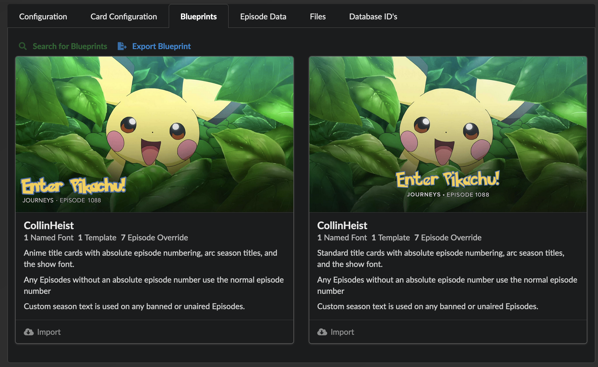

# Blueprints

!!! warning "Under Construction"

    This documentation is actively being developed.

_Blueprints_ can be viewed as Templates on :material-needle: steroids. These are
ready-made collections of cards configurations that apply to a single Series.
Blueprints allow for importing a pre-made customization for a Series, including
any applicable Named Fonts, Templates, Series options, _and_ Episode-specific
overrides.

??? example "Example"

    Don't want to spend an hour of your life combing through the Pokémon
    Wikipedia in order to determine which specific Episodes apply to which
    specific seasons? Blueprints allow you to just take the hour of my work and
    apply everything with the click of a button.

    

All Blueprints are hosted on the
[companion repository](https://github.com/CollinHeist/TitleCardMaker-Blueprints/)
and anyone can (and is encouraged to!) submit a Blueprint for availability
across all of TCM. This process is described
[below](#sharing-your-own-blueprint).

## Importing a Blueprint

To import a Blueprint for a Series, simply open the Series' page and then open
the _Blueprints_ tab. Click `Search for Blueprints`, and TCM will look for any
available Blueprints for this Series. If any are available, a card will show you
the details.

On this card will be a preview of the Blueprint, as well as what customizations
will be imported. This can be any number of Fonts, Templates, or Episode
overrides.

After picking the Blueprint you like, simply click :material-cloud-download:
`Import` and TCM will grab and apply the Blueprint for you.

!!! note "Note about Font Files"

    If the Blueprint has any Named Fonts that include custom font files, you
    might be prompted to download the Font file from a 3rd party website. This
    is sometimes required as a Font's license might not allow it to be
    redistributed by TitleCardMaker.

    TCM will import the rest of the Font customizations for you, so just be sure
    to upload the Font files before you start Title Card creation.

Once a Blueprint has been imported, you are free to make any edits to the
Series, Templates, or Fonts as you see fit. TitleCardMaker will not override
your changes with the Blueprint settings unless you prompt it to do so by
re-importing the Blueprint.

## Sharing your own Blueprint

In order to help other TitleCardMaker users, it is encouraged to share any
Blueprints you think would be valuable to others. This process is designed to be
as easy as possible.

!!! tip "Submission Checklist"

    If you are already familiar with GitHub, and just want a quick checklist of
    what to do for your Blueprint submission, see below:

    - [x] Export your Blueprint within the TCM UI.
    - [x] Choose an effective preview image.
    - [x] [Create an issue](https://github.com/CollinHeist/TitleCardMaker-Blueprints/issues/new?assignees=CollinHeist&labels=blueprint&projects=&template=new_blueprint.yml&title=%5BBlueprint%5D+)
    on the Blueprints repository.
    - [x] Fill out the issue form's required data:
        - [x] Series name, year, your username, and the blueprint description
        - [x] Copy/paste the contents of the exported `blueprint.json` file in
        the _Blueprint File_ field.
        - [x] Upload any associated files.
        
            !!! tip "Uploading Multiple Files"

                If you have more than one file to upload - i.e. a preview image
                _and_ 1+ Font files - then compress/zip these files and only
                upload the zipped file.


            - [x] Verify any Font licenses permit the files to be shared - if
            not, [see below](#editing-the-blueprint).

### Exporting the Data

Once you've customized a Series' Cards to :pinched_fingers: _perfection_, open
it's page in TitleCardMaker, and then go to the _Blueprints_ tab. Click the
:fontawesome-solid-file-export: `Export Blueprint` button, and TCM will do a few
things:

1. If the Series (or any linked Templates) have a Named Font -  __this includes
those linked directly to Episodes__ - it will copy any Font files;
2. Search for and copy the first available[^1] Title Card for the Series;
3. Convert the Series, Templates, Fonts, and Episode customizations into a
Blueprint "object" written as JSON.

All of this data is then bundled into a `.zip` file and downloaded through your
browser. This is (practically) all you need in order to submit the Blueprint.

### Editing the Blueprint

Before submitting the Blueprint to the repository, it's best to double-check the
data in the Blueprint for validity.

1. Review that the Preview image is appropriate, present, and representative of
the Blueprint.

    ??? question "No Preview Image Present?"

        If TCM did not include a `preview` file in the zip, then there were no
        valid Cards for it to export. You can grab any existing Card in its
        place.

    ??? tip "Changing the Preview"

        TCM only automatically chooses a Card for you in order to be helpful.
        You can pick any Card you'd like for the preview.

5. Verify the actual contents of the Blueprint. Any customizations can be
edited, removed, or adjusted. But to prevent any errors, it's best to edit these
values within TCM itself and then just re-export the Blueprint.

6. Verify the Licenses for any exported Font files. Please only upload the file
if the author's license is listed as open and/or free for public
(non-commercial) use and distribution.

    === ":octicons-check-16: Font is Public"

        If the Font is public, then you are free to include the Font file itself
        inside the Blueprint. Please take note (either the URL or a screenshot)
        of the License to be included in the Issue if needed.

    === ":octicons-x-16: Font is Not Public"

        If the Font is _not_ public, **do not** include the Font file in the
        Blueprint. Remove reference to this file from the `blueprint.json` file,
        and you can include a URL where TCM users can find the Font themselves
        under the `file_download_url` field. For example:

        ```json title="blueprint.json" hl_lines="8-9"
        {
            "series": {},
            "episodes": {},
            "templates": [],
            "fonts": [
                {
                    "name": "Better Call Saul",
                    "file": "script-casual-normal.ttf", // (1)
                    "file_download_url": "https://www.google.com/" // (2)
                }
            ]
        }
        ```

        1.  _Delete_ this line.
        2. _Add_ this line with the URL for your specific Font.

    === ":octicons-question-16: Cannot Find License"

        If you cannot find the applicable license for a Font, assume the Font
        is not public and follow those instructions.

### Submitting the Blueprint

With this Blueprint, the next (and final) step is to submit it to the Blueprints
repository.

1. Open a [new issue](https://github.com/CollinHeist/TitleCardMaker-Blueprints/issues/new?assignees=CollinHeist&labels=blueprint&projects=&template=new_blueprint.yml&title=%5BBlueprint%5D+)
on the Blueprints GitHub repository.

2. Fill out the form with the relevant information.

3. Paste the contents of the exported `blueprint.json` file into the _Blueprint
File_ field.

4. Upload a preview Title Card into the _Preview Title Card_ section of the form.

5. The last step is only applicable to Blueprints _with_ custom Font files:

    === "No Font Files"

        If your Blueprint does not have any custom Font files, you can skip this
        step.

    === "Font Files"

        If you have at least one Font file - then you need to compress/zip all
        Font Files into one zip file and drag/drop or attach that zipped file
        into the _Zip of Font Files_ field.

        ??? question "Why is this necessary?"

            This is required because GitHub only allows directly uploading files
            of specific extensions, and Font extensions are not on that list.

5. Click the _Submit new issue_ button.

!!! success "Success"

    After the issue is created, there is an automated action that will validate
    your submission (check for syntax errors, bad file uploads, missing preview,
    etc.). If this passes, then your work is done and the Blueprint will be
    available within TCM shortly.

[^1]: TCM will only grab Title Cards that are not blurred or grayscale, and not
any Cards from Specials (season 0).