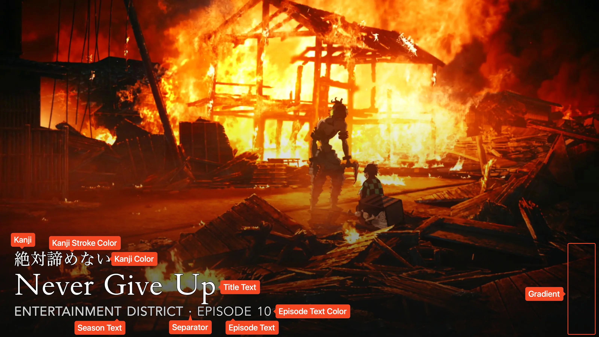

# Anime Card Type

!!! warning "Under Construction"

    This documentation is actively being developed.

This card design was created by [CollinHeist](https://github.com/CollinHeist),
and designed by Reddit User
[/u/Recker_Man](https://www.reddit.com/user/Recker_Man). Because this is the
only card which explicitly supports adding kanji, this is the de-facto
card type used for _most_ Anime series by _most_ users.

These cards feature relatively unobtrusive text in the lower left-hand corner of
the image. The kanji, title, and season/episode text can all be adjusted.

<figure markdown="span" style="max-width: 70%">
  
</figure>

??? note "Labeled Card Elements"

    

## Adding Kanji

This card supports the addition of Kanji (Japanese text) to the Card through
TCM's built-in [translation](...) feature.

For the specified Series (or within a Template), add a translation which reads
as "Translate `Japanese` titles into `kanji`".

!!! tip "Recommendation"

    Rather than specifying this translation for each Series, it is recommended
    to use a [Template](../user_guide/templates.md) containing the correct card
    type and translation(s), and then add that Template to your Series.

    To go one step further, you can auto-assign this Template to a subset of
    your Series when [Syncing](../user_guide/syncs.md); _or_ add the Template
    with some filters (i.e. by library name) to your
    [Global Templates](../user_guide/settings.md#...).
