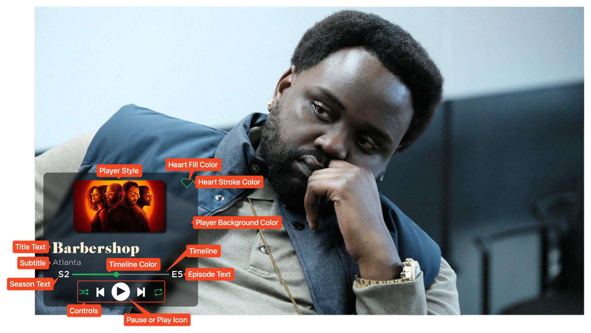

<link rel="stylesheet" type="text/css" href="https://unpkg.com/image-compare-viewer/dist/image-compare-viewer.min.css">
<!--  -->

# Music Card Type

This card design was created by [CollinHeist](https://github.com/CollinHeist),
and is inspired by a music player (Spotify in particular).

These cards feature a fully adjustable music timeline, media control buttons,
and artwork. This is one of the more complex card types, featuring more than 
twenty available extra customizations.

<figure markdown="span" style="max-width: 70%">
  
</figure>

??? note "Labeled Card Elements"

    

## Adjusting the Player Style

Above the title text, various kinds of "album art" can be added to the Card by
adjusting the _Player Style_ extra. This can be `basic`, `artwork`, `logo`, or
`poster`.

!!! tip "Automatically Downloading Artwork"

    If the style is set to `artwork`, backdrops __will not__ be automatically
    downloaded. You will need to download these manually for the Series.

??? example "Example"

    

        
        
    

    

        
        
    

## Controls

### Enabling

Stylized music control icons / buttons can be added to the Card, if desired, by
setting the _Control Toggle_ extra as `True`.

??? example "Examples"

    

        
        
    

### Coloring

If the music controls are [enabled](#enabling), then each individual
control icon can be recolored (or omitted completely) with the _Control Colors_
extra.

This must be a set of five space-separated colors, where each color will be
used on the controls in order.

!!! warning "Colors with Spaces"

    All specified colors __cannot__ have spaces. For example, write
    `rgb(1, 1, 1)` as `rgb(1,1,1)`.

If a color is given as `transparent` or `none`, that control icon will be
removed.

??? example "Examples"

    

        
        
    

    

        
        
    

### Pause or Play Icon

The middle icon on the controls can be toggled between a pause and play icon
with the _Pause or Play Icon_ extra. If set to `watched`, then the icon (and
Card) will update any time the watched status of the Episode changes.

??? example "Example"

    

        
        
    

## Heart Icon

A small heart / like icon can also be added to the top right of the player. This
icon can be toggled and recolored with extras.

!!! warning "Icon Overlap"

    TCM does not implement any logic to prevent the heart icon from overlapping
    album artwork or title text.

### Enabling

The heart icon is disabled by default, but can be enabled by setting the _Heart
Toggle_ extra as `True`.

??? example "Example"

    

        
        
    

### Coloring

The heart icon can be recolored in two ways. The edge / stroke of the icon with
the _Heart Stroke Color_ extra, and the inside / fill of the icon with the
_Heart Fill Color_ extra. These are separated so that the heart can be visible
while not appearing "selected."

??? example "Examples"

    The following shows an adjustment to the _Heart Stroke Color_.

    

        
        
    

    The following shows an adjustment to the _Heart Stroke Color_ __and__
    _Heart Fill Color_ extras.

    

        
        
    

## Timeline

### Coloring

The color of the filled portion of the timeline can be adjusted with the
_Timeline Color_ extra. This only applies to the filled portion - e.g. the
[percentage](#filled-percentage) - and the "bubble".

??? example "Example"

    

        
        
    

### Filled Percentage

The filled logic for the timeline is customizable with the _Timeline Fill
Percentage_ extra.

If this is set to an explicit number - such as `0.3` - then the timeline will
always be that percent filled. The number will be interpreted as a percentage.

If this is specified as `random` (or left as the default) then each Card will
utilize a random fill percentage.

Finally, this can also be given as a [Format String](../user_guide/variables.md)
in which case TCM will calculate the percentage for each Card. For example, by
setting this extra to `{episode_number / season_episode_max}`, the timeline
percentage will be "filled" from 0% to 100% for each season.

!!! tip "Common Uses"

    Some common specifications for this percentage are:

    - `{episode_number / season_episode_max}` - progress the timeline for each
    _season_. Meaning the first Episode of the season would start near 0% 
    filled, and the last Episode would be 100%.
    - `{absolute_number / series_absolute_max}` - progress the timeline for the
    entire Series. Meaning the first Episode of the Series would start near 0%
    filled, and the last Episode of the Series would be 100%. This will only
    work for Series with absolute numbering from Sonarr.

!!! warning "Warning About Format Strings"

    Be careful when specifying a self-calculating format string for the filled
    percentage for currently airing Series/seasons. If the format specified
    changes every time a new Episode aires, then all Cards affected by this
    change will be remade and reloaded for each new Episode.

## Player Positioning

### Overall Position

The position of the player can be adjusted by setting _Player Position_ to
either `left`, `middle` or `right`.

??? example "Example"

    

        
        
    

### Player Inset

The _Player Inset_ extra allows more fine-tuned control of how far from the 
edge of the image to place the player. This is applied to both the horizontal
and vertical spacing.

??? example "Example"

    

        
        
    

## Player Width

The width of the player can also be adjusted with the _Player Width_ extra. All
elements within the player - notably the timeline and any album artwork - are
dynamically resized with the specified width.

??? example "Example"

    

        
        
    

## Player Color

The background color of the player can be adjusted with the _Player Background
Color_ extra.

??? example "Example"

    

        
        
    

## Subtitle Text

The text below the title is referred to as the subtitle. This text can be
edited via the _Album Subtitle_ extra.

This can be set to a [Format String](../user_guide/variables.md) to dynamically
adjust the text to your liking. Setting it to `{""}` will remove the subtitle
completely. See the full list of available variables
[here](../user_guide/variables.md).

!!! tip "Common Uses"

    Some common specifications for this are:

    - `{series_name}` to put the Series name (the default)
    - `{series_full_name}` to put the Series name and year
    - `{series_name}, Season {season_number}` to put the Series name and the
    season number

??? example "Example"

    

        
        
    

## Album Image Corner Rounding

To add to the "album art" aesthetic, the corners of images are rounded when the
[Player Style](#adjusting-the-player-style) is set to `artwork` or `poster`.

This can be disabled by setting the _Round Album Corners Toggle_ extra to
`False`.

??? example "Example"

    

        
        
    

## Title Line Truncation

Because the player design does not lend itself very well to extremely long
titles, this card automatically truncates titles (with `...`) which are longer
than a set number of lines. This behavior can be modified (or disabled) with the
_Long Line Truncation_ extra.

Setting this to some number will cut off text after that many lines; and setting
this to `False` will stop truncation altogether.

??? example "Example"

    

        
        
    

