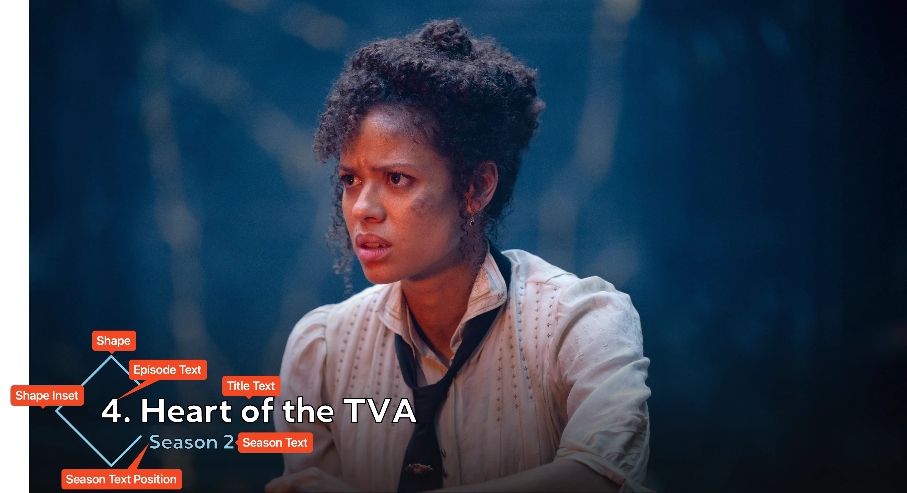

<link rel="stylesheet" type="text/css" href="https://unpkg.com/image-compare-viewer/dist/image-compare-viewer.min.css">

# Striped Card Type

This card design was created by [CollinHeist](https://github.com/CollinHeist).
These cards feature a shape (of various kinds) which surrounds the title text.
The default shape is a diamond, but circles, squares, and two orientations of
triangles are also implemented. 

<figure markdown="span" style="max-width: 70%">
  
</figure>

??? note "Labeled Card Elements"

    

## Episode Text

The Shape card is different from most other card types in that the episode text
is _added to_ the title text. This also applies to custom episode text from the
_Episode Text Format_ Card option.

By default, the format used for the episode text is `{episode_number}.` which
is then added to the beginning of the title text (unless episode text is
hidden).

## Shape Adjustments

The focal point of this card is the "shape" element which can be colored,
positioned, resized, and changed with various extras.

### Color

The _fill_ color of the shape can abe adjusted with the _Shape Color_ extra.
This color does support transparency.

!!! note "Affect on Season Text Color"

    Changing this will also change the color of the season text, unless that
    color is manually specified - see [here](#color-2).

??? example "Examples"

    

        
        
    

### Inset

How far from the edge of the image the shape is drawn can be adjusted with the
_Shape Inset_ Extra. This affects the vertical and horizontal spacing if the
[Text Position](#position) is set to anything other than `left` or `right`, in
which case this only affects the horizontal spacing.

??? example "Examples"

    

        
        
    

### Shape

What kind of shape that's displayed can be adjusted with the _Shape_ Extra. This
setting allows for "hard coding" the shape - e.g. a fixed value of `circle` will
always produce a circle shape; or for some randomization between shapes.

If this is specified as `random`, then a shape will be all available options
(`circle`, `diamond`, `square`, `down triangle`, and `up triangle`).

If specified _like_ `random[shape1, shape2, ...]`, then a shape will be selected
from any of the specified shapes. These __must__ be comma-separated lowercase
shapes from the available shape options. Repition is allowed, in which case the
given shape will have a proportional probability of being selected.

!!! example "Randomized Shapes"

    If this Extra were specified as `random[square, square, square, diamond]`,
    then a square shape would be selected 75% of the time (3/4) while a diamond
    would be the other 25%.

Randomized shape selection is per-card, meaning regenerating the same Card may
result in a different shape.

??? example "Examples"

    

        
        
    

    

        
        
    

    

        
        
    

### Size

How large the shape is can be adjusted with the _Shape Size_ Extra. This is
a scalar applied to the default size for each shape.

For titles which take up multiple lines of text, TCM automatically scales the
size of the shape by an additional 30% per line of text. This is _in addition
to_ the scalar specified here. Meaning a shape with a specified size of 110% and
a two-line title would be effectively 143% (1.30 * 1.10).

!!! warning "Potential Sources of Error"

    Setting this to values which are very far from `1.0` (especially smaller
    than) can result in odd text placement _or_ the Shape not being drawn at
    all. This is due to the drawing algorithm in which TCM attempts to check
    that the shape lines do not overlap the text.

??? example "Examples"

    

        
        
    

### Stroke

#### Color

Once [enabled](#width), the color of the shape stroke can be adjusted with the
_Shape Stroke Color_ Extra.

??? example "Examples"

    

        
        
    

#### Width

By default, there is no stroke added to the displayed shape. By setting the
_Shape Stroke Width_ to some value greater than 0, a stroke will be added.

??? example "Examples"

    The stroke is hard to see on the following image (due to the darker
    coloring). The effect is most prominent on light images.

    

        
        
    

### Toggle

The shape can be completely removed with the _Hide Shape_ Extra. This does not
change the text positioning.

??? example "Examples"

    

        
        
    

### Width

How wide (or thick) the shape appears can be adjusted with the _Shape Width_
extra.

??? example "Examples"

    

        
        
    

## Season Text

Unlike most other card types, on the Shape card, the season text is completely
separated from the episode text. However, a majority of the Extras found on
other card types - e.g. the _Episode Text Color_, _Episode Text Font
Size_, etc. - are available on this card, they are just for __only__ the season
text.

### Color

The color of the season text can be adjusted with the _Season Text Color_ extra.
By default, this matches the [Shape Color](#color) extra, but a manually
specified color will override that behavior.

??? example "Examples"

    

        
        
    

### Italics

The season text can be displayed in two variations ("standard" and "italic") by
adjusting the _Italize Season Text_ Extra.

??? example "Examples"

    

        
        
    

### Position

The position of the season text relative to the title text can be adjusted with
the _Season Text Position_ Extra.

??? example "Examples"

    

        
        
    

### Size

The size of the season text can be adjusted with the _Season Text Font Size_
Extra. This functions identically to the normal font size adjustment.

??? example "Examples"

    

        
        
    

## Mask Images

This card also natively supports [mask images](../user_guide/mask_images.md).
Like all mask images, TCM will automatically search for alongside the input
Source Image in the Series' source directory, and apply this atop all other Card
effects.

!!! example "Example"

    

        
        
    

