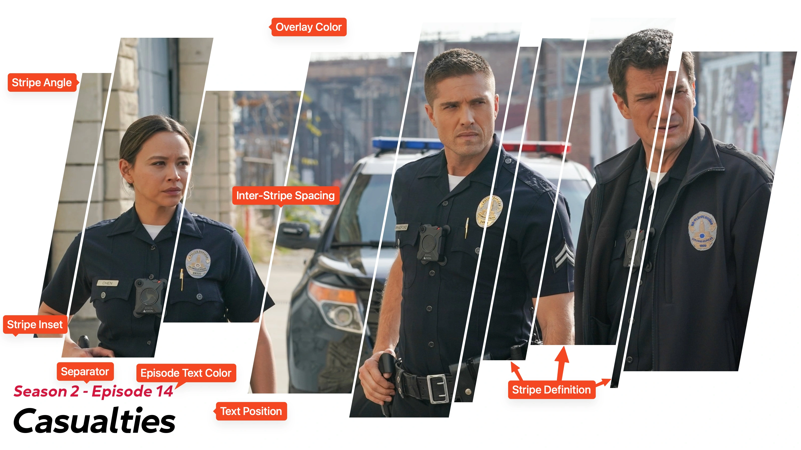

# Striped Card Type

!!! warning "Under Construction"

    This documentation is actively being developed.

This card design was created by [CollinHeist](https://github.com/CollinHeist),
and was inspired by some of the official artwork for
[The Rookie](https://www.themoviedb.org/tv/79744-the-rookie/images/posters).

These cards feature a solid color overlay with stripes of rectangles "cut" out
to expose the underlying Source Image. By default the stripes are randomly
placed and sized, but this can be adjusted with [an extra](#definition). The
position of the text can also be adjusted to any of the four corners.

<figure markdown="span" style="max-width: 70%">
  
</figure>

??? note "Labeled Card Elements"

    

## Stripe Adjustments

## Angle

The angle of the stripes can also be adjusted with the _Stripe Angle_ extra.
A value of 90 degrees will result in the stripes being perfectly vertical, and
the "orientation" of the stripes can be reversed by specifying angles larger
than 90.

??? example "Examples"

    

        
        
    

## Definition

!!! warning "Advanced Setting"

    This setting is fairly complicated relative to the other available extras.

The specific order, width, and level of randomization of the stripes can be
fine-tuned with the _Stripe Definition_ extra.

By default, this card selects a random size and then a random width of that
size - repeating the process until the card is "full" (i.e. no more horizontal
space). These pre-defined sizes are "small", "medium", and "large" and have been
abbreviated as `s`, `m`, and `l`.

This extra supports six different "kinds" of unique patterns to control how
the stripes are drawn.

### Random Order, Random Sizes

Specifying a definition _like_ `random[sml]` will instruct TCM to randomly select
a stripe of the listed sizes _in_ the specified ratio. This means that repeating
sizes - e.g. `random[sssssml]` - will result in those appearing with increased
frequency. For example `sml` will mean all sizes are equally likely, while
`ssml` will mean small stripes are twice as likely as medium or large. The width
of each stripe will use the builtin size ranges.

??? example "Examples"

    Notice how the right-image has a much higher frequency of large (`l`)
    stripes.

    

        
        
    

This pattern will always fill the width of the card.

### Random Order, Fixed Sizes

Specifying a definition _like_ `random[100,200]` will instruct TCM to randomly
select stripes of the listed width in the specified ratio. For example,
`random[100,200]` will result in random stripes of either 100 or 200 pixels
wide. Repition is allowed. These must be comma-separated positive values.

??? example "Examples"

    

        
        
    

This pattern will always fill the width of the card.

### Random Order, Random Size Ranges

Specifying a definition _like_ `random[10-20,200-250]` will instruct TCM to
randomly select stripes of random widths from the specified ranges in the
specified ratios. For example: `random[10-20,200-250]` will result in random
stripes of widths between 10 and 20 pixels _or_ 200 and 250 pixels (in equal
likelihood). Repition is allowed. These must be comma-separated positive values
in which the second value is equal to or greater than the first.

??? example "Examples"

    

        
        
    

This pattern will always fill the width of the card.

### Fixed Order, Random Sizes

Specifying a definition _like_ `sml` will instruct TCM to generate stripes in
the specified order of random widths. For example: `sml` will always generate a
small, medium, and large stripe (repeated if a `+` is specified). The width of
each stripe will use the builtin size ranges.

??? example "Examples"

    

        
        
    

This pattern will __not repeat__ unless it ends with `+` - e.g. `sml+`.

### Fixed Order, Fixed Sizes

Specifying a definition _like_ `10,100,400` will instruct TCM to generate
stripes in the specified order of the specified widths. For example:
`10,100,400` will generate stripes that are 10, 100, and 400 pixels wide
(repeated if a `+` is specified). These must be comma-separated positive values.

??? example "Examples"

    

        
        
    

This pattern will __not repeat__ unless it ends with `+` - e.g. `10,100,400+`.

### Fixed Order, Random Size Ranges

Specifying a pattern _like_ `10-50,400-800` will instruct TCM to generate
stripes in the specified order of random widths from the specified ranges. For
example: `10-50,400-800` will result in a stripe between 10 and 50 pixels wide,
and another between 400 and 800 pixels wide (repeated if a `+` is specified).
These must be comma-separated positive values.

??? example "Examples"

    

        
        
    

This pattern will __not repeat__ unless it ends with `+` - e.g. `10-50,400-800+`.

## Inter-Stripe Spacing

The spacing between sequential stripes can be adjusted with the _Inter-stripe
Spacing_ extra.

??? example "Examples"

    

        
        
    

## Episode Text Adjustments

For adjustments, the "episode text" refers to the combined season and episode
text.

### Color

The color of the episode text can be adjusted with the _Episode Text Color_
extra.

??? example "Examples"

    

        
        
    

### Size

The size of the episode text can be adjusted with the _Episode Text Font Size_
extra. The boundaries for the stripe height are dynamically adjusted to prevent
the stripes from overlapping the episode text.

??? example "Examples"

    

        
        
    

## Overlay Color

The color of the solid overlay can be adjusted with the _Overlay Color_ extra.
This extra _does_ support transparency.

??? example "Examples"

    

        
        
    

## Separator Character

If both the season and episode text are displayed on the Card, then a separator
character is added between them. This character can be adjusted with the
_Separator Character_ extra.

## Mask Images

This card also natively supports [mask images](../user_guide/mask_images.md).
Like all mask images, TCM will automatically search for alongside the input
Source Image in the Series' source directory, and apply this atop all other Card
effects.

!!! example "Example"

    

        
        
    

