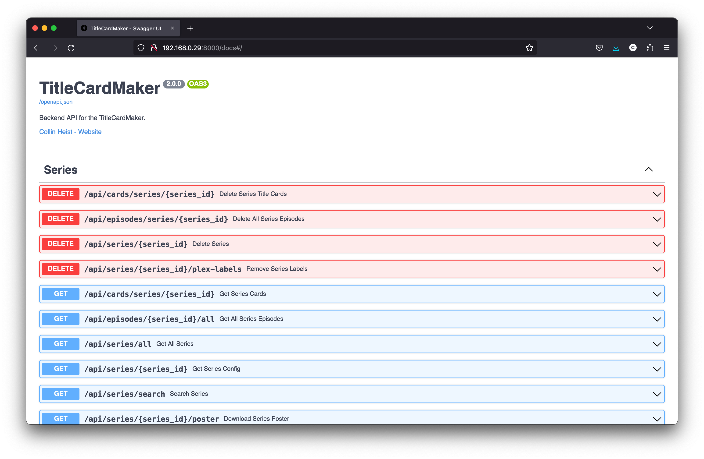
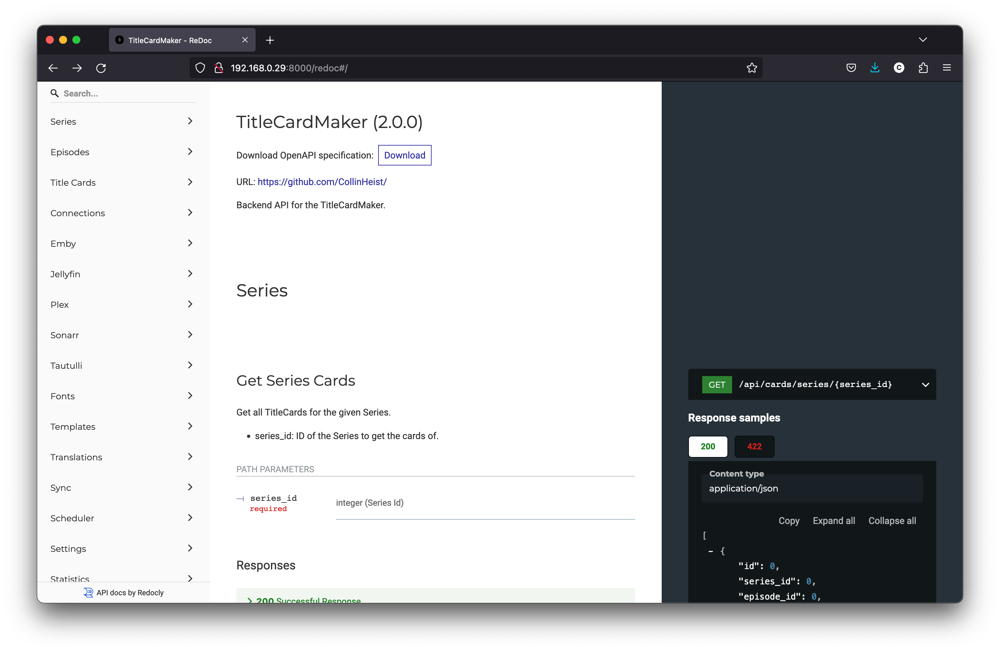

# The API

The TitleCardMaker API is auto-generated, documented, and fully interactable via
the `/docs` and `/redoc` URLs. These are OpenAPI and ReDoc API documentations.
An example of each is shown below:

These API endpoints are utilized by the TCM UI to perform all actions, so
examples of how these endpoints are utilized can be found by exploring the TCM
front-end source code.

Contributions to annotate the API and/or the documentation is welcome.

!!! tip "Behind the Scenes"
    
    This documentation is generated by
    [Swagger UI](https://github.com/swagger-api/swagger-ui), and
    [ReDoc](https://github.com/Redocly/redoc) via the
    [FastAPI](https://fastapi.tiangolo.com/) module.