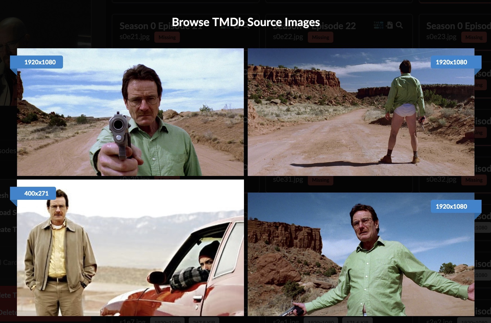

# Creating Title Cards

## Background

There has been a lot of preamble, but the core of TitleCardMaker is making
Title Cards. We'll be creating Title Cards in order to showcase the effects of
our Templates, as well as show how these Cards can be further customized.

!!! example "Example Series"

    This part of the tutorial will refer to _Breaking Bad_ as the example Series. 
    Those who decided to Sync a Series __other than__ _Breaking Bad_ can still
    follow these steps, just apply them to whatever Series you chose.

## Instructions
### Episode Data
1. Go to the _Breaking Bad_ Series configuration page - you can quickly access
it by searching for the title in the top left search bar (next to the TCM logo).

2. Just below the poster is a set of action buttons. Click the `Refresh Episode
Data` button. TCM will now query your global Episode Data Source for new
Episodes.

    !!! note "Scheduled Task"

        Refreshing Episode data happens automatically as a
        [scheduled task](./scheduler.md), __unless__ the Series is marked as
        `Unmonitored`.

3. Open the "Episode Data" tab - there should now be either 62 or 80 Episodes,
depending on whether you have turned on or off the Specials syncing.

### Source Images

4. Open the "Files" tab. This tab shows image information for all Source Images
for each Episode of the Series. Since we just added _Breaking Bad_, all images
should show as missing.

5. For Season 1 Episode 1, click the small TMDb logo. This will launch a browser
for all Source Images on TMDb. Clicking any image will request TCM download it
and store it inside the Source Image directory. Download any image.

    ??? tip "Image Resolution"
    
        In the corner of each image is a small ribbon that indicates the
        resolution of the image.
        
        When manually browsing the images on TMDb, your global minimum
        resolution is ignored.

    

6. Close the image browser. The file for that Episode should now be filled in
with Source Image information.

7. To tell TCM to _automatically_ gather Source Images, click the `Download
Source Images` button on the left-hand side.

    !!! note "Scheduled Task"

        Downloading Source Images happens automatically as a
        [scheduled task](./scheduler.md), __unless__ the Series is marked as
        `Unmonitored`.

Now that TCM has started downloading Source Images, we are ready to create Title
Cards.

### Title Cards

1. Click the `Create Title Cards` button on the left-hand side.

9. After TCM has created a few Cards, go to your file browser.

10. You'll see that Title Cards in Seasons 1 and 2 were created using our
Standard card type, as this was the higher priority (first) Template "Tier 1 -
Standard", and these Episodes meet the Filter condition we established of the
Season Number < 3. All other Title Cards were created with the lower priority
(second) Template "Tier 0 - Tinted Frame" as they do not meet the Filter
criteria.

11. Back within TCM, go to the "Episode Data" tab and change the card type of
Season 2 Episode 1 to something else. Save this change by clicking the
:material-content-save: Save icon in the left-most column.

12. Click the `Create Title Cards` button again, and TCM should inform you that
it i creating 1 card and deleting 1 card. Looking at the file, this Card is now
made with the card type you _just_ selected, overriding any Template
specifications.

    ??? question "Why did the Tier 1 Template not apply?"

        Even though this Episode meets all the Template Filter criteria, any
        Episode-level customizations _override_ Series-level customizations.

        Because we entered this card type override on the Episode-level, the
        card type of the Templates are completely ignored.

!!! success "Tutorial Completed"

    With that finished, you have successfully grabbed Episode data, downloaded
    Source Images (manually _and_ automatically), created Title Cards, seen how
    Template Filters apply, as well as observed the effects of overriding card
    creation on an Episode-level.

    These are all the major components of TCM, and mark the end of the tutorial.
    If you have any other questions, you can browse this documentation or reach
    out for help on the [Discord](https://discord.gg/bJ3bHtw8wH).

!!! question "What's Next?"

    For most users, the next step is to create a Sync that doesn't just Sync
    the example Series, but instead _all_ (or large portions) of your Series.
    Review [Creating the First Sync](./first_sync/index.md) for a reminder on
    how to create Syncs.