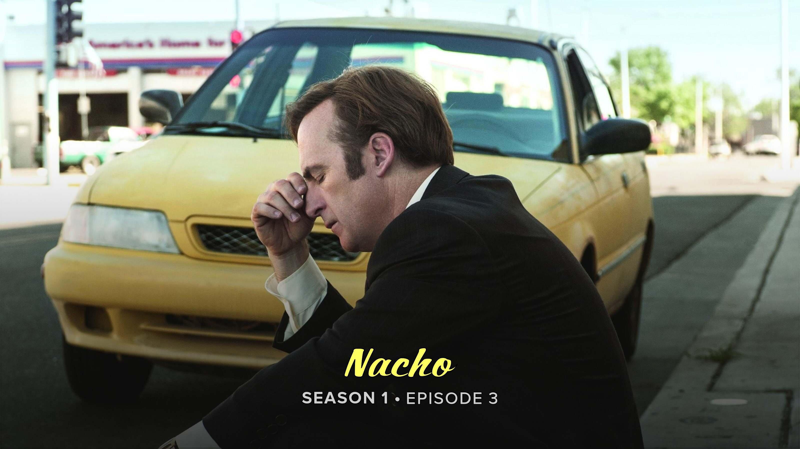

# Creating a Font
## Background

One main feature of TitleCardMaker is the ability to customize the fonts used on
title cards. This can provide an extra level of style and cohesion to your
server, but is also completely optional if you like the default fonts used on
all the cards.

There are two classifications of fonts in TCM - _named_ and _un-named_. _Named_
fonts are created in the :fontawesome-solid-font: `Font` page within TCM; while
_un-named_ fonts can be added directly to a Series or Episode. Aside from that,
the only differences between these two are that _named_ fonts can use custom
font files and character replacements in addition to metrics like font size,
spacing, etc.; while unnamed fonts can __only__ adjust metrics.

For this tutorial we'll create be creating a named font for Better Call Saul
that look like this (in particular the font used for the __title text__ `Nacho`):

## Instructions

1. Navigate to the font page by clicking :fontawesome-solid-font: `Fonts` from
the side navigation bar.

2. Create a new font by clicking the `Create New Font` button.

3. Expand the created font by clicking the accordion called "Custom Font".

4. Rename the font "Better Call Saul"

5. In the "Title Color" field, put `#FFFF61`.

    !!! tip annotate "Colors"

        TitleCardMaker (through ImageMagick) supports multiple styles of colors.
        The above color is an RGB Hexcode, but is equivalent to the following:

        - `rgb(255, 255, 97)` - meaning Red Green Blue
        - `rgba(255, 255, 97, 0%)` - meaning Red Green Blue Alpha
        - `hsl(60, 100%, 69%)` - meaning Hue Saturation Lightness
        
        And if this color had a "name" - like `yellow` - we could use that as
        well.

        You can use an online tool like
        [this](https://www.w3schools.com/colors/colors_converter.asp) to switch
        between the color types.

    ??? tip ":material-apple: MacOS Color Picker"

        If you are on MacOS, there is a very useful built-in color "picker".
        You can access this by opening `Digital Color Meter` from Spotlight. It
        will show you the RGB values of any pixel on screen, and these can be
        directly entered into an `rgb()` color code.

6. In the "Text Case" dropdown, select `Source`.

    ??? question "What does this mean?"

        The text case is what case to apply to the title text. E.g. uppercase,
        lowercase, etc. The source case tells TCM to take the title directly as
        it comes from the episode data source (the actual title) and to not
        modify it.

7. Download [this font](https://fontmeme.com/fonts/script1-script-casual-font/).

8. In the "Font" file input, click `Browse` (or your Browser equivalent) and
then select the file we just downloaded.

9. Click `Save Changes` to save your changes and upload the file.

    !!! note "The Font File"
    
        Behind the scenes, TCM will download the font file you just uploaded,
        and store it internally (in your asset directory) - so you can now
        delete it from your downloads folder without breaking its link to TCM.

!!! success "Custom Font Created"

    You have successfully created a custom _named_ font for use later in the
    tutorial.
    
    Although we did not use a majority of these font customizations, this is
    largely due to the specific font file we're using. Some fonts require a lot
    more tinkering to get the perfect look. All of the available options are
    described [here](...).