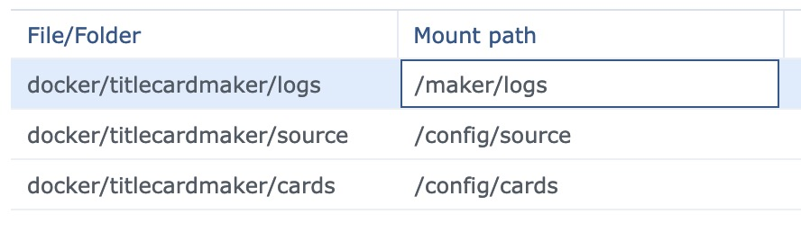

# Synology DSM Docker Installation

!!! info "Benefits of Docker"

    For more info on the benefits of Docker, see [here](./index.md).

For Synology DSM users, the available Docker manager can be used to
easily set up TitleCardMaker with all the necessary Docker variables and
paths.

!!! note "Directory Assumptions"

    These instructions assume you have a `/docker` root folder on your NAS. If
    this is at a different location, then adjust the listed paths (notable in
    Step 8b) to your setup. If you do not have a Docker directory, create one.

1. Login to the DSM Web Interface.
2. If the Docker application is not already installed, follow these steps:

    1. Launch `Package Center`.
    2. Search `Docker` from the top search bar, install the package with
    the whale icon.

3. Launch the Docker application from the main menu.
4. Select `Registry` from the sidebar, and then search `titlecardmaker`.
5. Double click the first result (`collinheist/titlecardmaker`). You will be
prompted to choose which branch (or _tag_) to install, make your selection and
continue.

    ??? tip "Choosing the Right Branch"

        For most users, I recommend the default `latest` branch. This branch is
        updated with the most recent public release of TitleCardMaker, and is
        the most stable option.

        For users who are okay with the occasional bug, and would like to test
        out features _as they are developed_, then choose the `develop` tag.

6. Go to `Images`, and once the container has finished downloading,
select it and click `Launch`.
7. Fill out the General Settings

    ??? tip "Recommended General Settings"

        The container name is completely personal preference, so something like
        `TitleCardMaker` is sufficient.

        __Do not__ execute the container using high privledge.

        I do not recommend enabling resource limitation, but this is also a
        personal preference.

8. Select `Advanced Settings`, and fill out the following:

    === "Advanced Settings"

        1. Check :material-check: `Enable auto-restart`

    === "Volume"
    
        1. Add one Folder, navigate to `/docker`, create a `titlecardmaker`
        subfolder - e.g. `/docker/titlecardmaker/`.
        2. In the mount path for `docker/titlecardmaker`, enter
        `/config/`. Your setup should look like this:

        

    === "Network"

        N/A

    === "Port Settings"

        1. Add a port
        2. Enter the port settings as `4242` `4242` `TCP`.

    === "Links"

        N/A

    === "Environment"

        !!! warning "Work in Progress"

            This will be added later. # TODO

9. Hit `Apply`, `Next`, then `Apply` again.

## Firewall

_If_ you have a Firewall established, do the following:

1. Launch `Control Center`.
2. Go to the `Firewall` tab.
3. Select `Edit Rules` for your current profile.
4. Hit `Create`.
5. For Ports, toggle `Select from a list of built-in applications`, then
find and enable the TitleCardMaker Docker container.
6. Ensure the Source IP is All, and the Action is Allow.
7. Make sure this new rule is _above_ any base `Deny` action(s).
8. Hit `OK`.

!!! success "Success"

    Installation is complete, and TitleCardMaker is ready to be configured. It
    can be accessed at `http://{server ip}:4242`, where `{server ip}` is the
    same IP address as your host NAS - e.g. `http://192.168.0.19:4242`.
