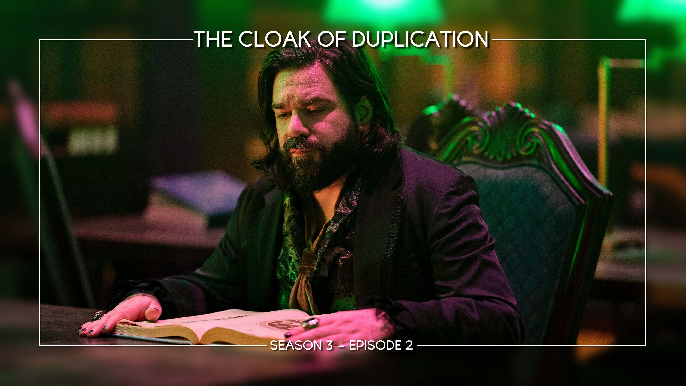
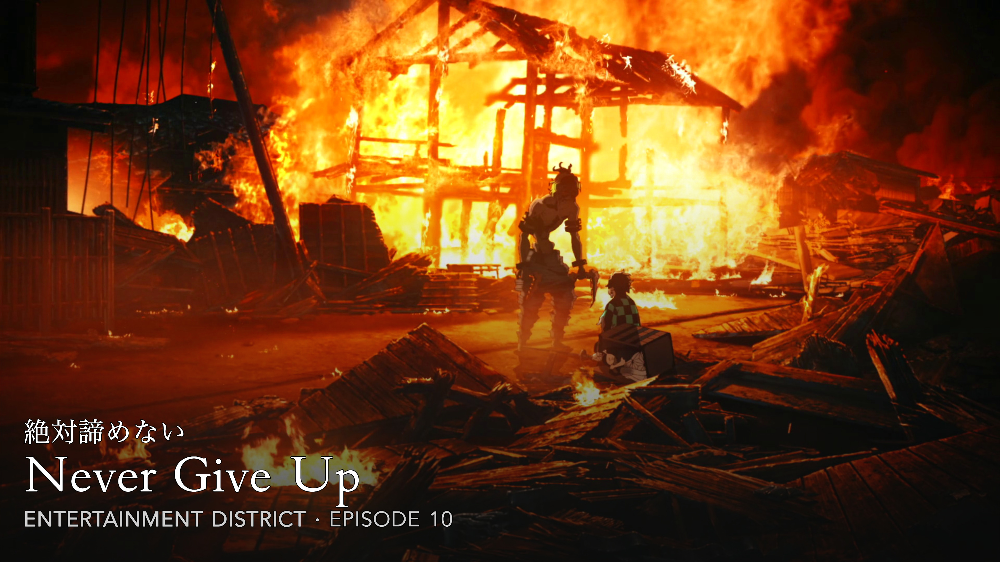

# Terminology

TitleCardMaker uses many specific terms throughout this documentation and within
TCM itself. Most of these will be explained as your progress through the
tutorial, but to help alleviate some confusion (and to serve as a reference),
here are the core concepts:

Title Card

:   The core "thing" which TCM revolves around. These are customized images
    which are the output of (created by) TCM. These are files which exist on
    your server in the `config/cards` directory[^1].

Source Image

:   An un-customized "raw" image from TMDb, Plex, etc. which TCM takes as
    inputs. You can think of these as the background of a Title Card on which
    TCM adds layers of text, images, effects, etc. to create a finished Title
    Card. These are files which exist on your server in the `config/source`
    directory.

Card Type

:   A specific type (or layout) of Title Card. Generally, two different card
    types can be easily visually distinguished, and each card type will have a
    unique set of customizations (called extras) which can be used to adjust the
    look of the Card.

    !!! example "Example"

        For example, the follow images are two different card types - the Tinted
        Frame and the Anime card type.

        
        

        As different types, each card allows unique customization. For example,
        the Tinted Frame card type gives options to adjust aspects of Frame,
        while the Anime card type has can have Japanese kanji added to it.

Font (or Named Font)

:   A set of custom properties - such as color, size, spacing, etc. - which
    can be created and customized within TCM to change some aspect of the text
    appearance on a Title Card. Fonts are defined in the TCM database, but any
    custom Font files live in the `config/assets/fonts` directory.

Template

:   A grouping of Title Card settings which makes editing the appearance of
    multiple Series at once easier. This can be thought of as a way to
    copy-paste settings.

Sync

:   This can be used as a noun or verb. _A Sync_ (noun) is an object which
    defines how how to add Series to TCM __automatically__ by communicating with
    Emby, Jellyfin, Plex, or Sonarr. _To Sync_ (verb) is the act of "running" a
    Sync and communicating with Emby, Jellyfin, Plex, or Sonarr to add new
    Series.

Blueprint

:   A pre-made set of card customizations for a specific Series. These are
    created and submitted by TCM users with the idea of making and sharing Title
    Card customizations easier. These can contain Fonts, Templates, and even
    Source Images. Blueprints are imported directly within TCM.

!!! tip "Confused?"

    If a specific idea is not 100% clear to you, it is often far easier to learn
    by _using_ TCM, rather than reading about it. There is very little downside
    to simply playing around with TCM. If you'd like, you can also ask for help
    on the Discord.

[^1]: By default, this can [be changed](../user_guide/settings.md#card-directory).
