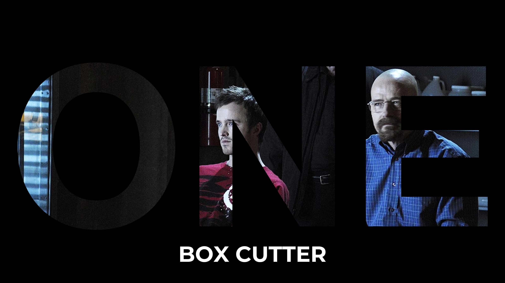
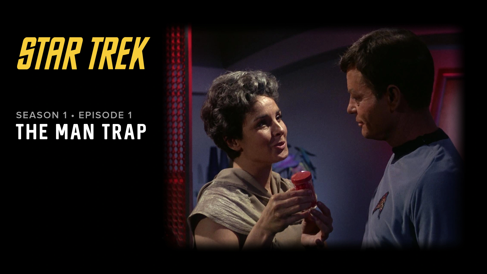
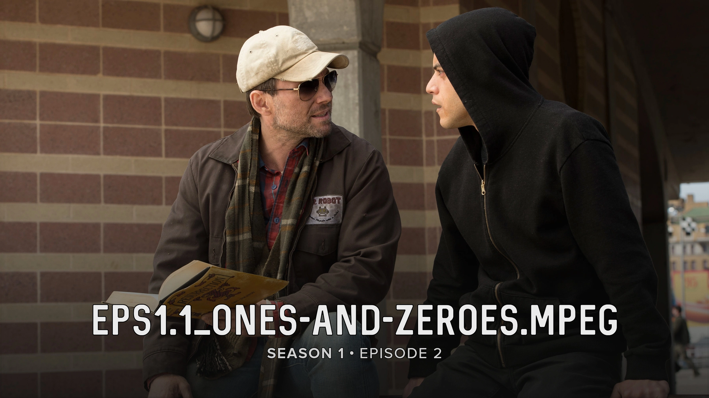
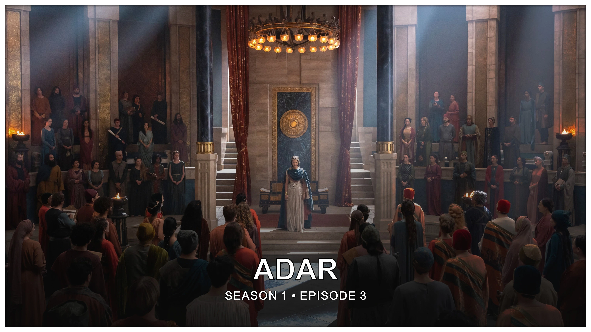

<script src="../../javascripts/home.js" defer></script>

# Welcome to TitleCardMaker

TitleCardMaker (TCM) is a program and Docker container written in Python that
automates the creation of customized Title Cards for use in personal media
server services like Plex, Jellyfin, or Emby. This is a self-hosted tool - 
meaning that it is installed and run on your computer.

<div class="scroller">
  <div class="scroller__inner">
    
    
    <a href="./user_guide/series"></a>
    <a href="./user_guide/series"></a>
    <a href="./user_guide/new_series"></a>
    <a href="./user_guide/new_series"></a>
    <a href="./blueprints"></a>
    <a href="./blueprints"></a>
    <a href="./user_guide/fonts"></a>
    <a href="./user_guide/fonts"></a>
    
    
  </div>
</div>

## What is a Title Card?

A Title Card is a thumbnail image for an Episode of television that can be used
to add a unique look within a personal media server like Plex, Emby, or
Jellyfin. Some Series have "official" Title Cards featured in the Episode
itself, but TCM specializes in creating and customizing "unofficial" Title
Cards. The following Cards have all been designed by me, and were created with
TitleCardMaker:

<div class="reversed randomized half-height very-slow padded rounded stylized scroller">
  <div class="scroller__inner">
    <figure data-label="Anime">
      <a href="./card_types/anime">
        
      </a>
    </figure>
    <figure data-label="Banner">
      <a data-label="Banner" href="./card_types/banner">
        
      </a>
    </figure>
    <figure data-label="Calligraph">
      <a data-label="Banner" href="./card_types/calligraphy">
        
      </a>
    </figure>
    <figure data-label="Comic Book">
      <a data-label="Comic Book" href="./card_types/comic_book">
        
      </a>
    </figure>
    <figure data-label="Cutout">
      <a data-label="Cutout" href="./card_types/cutout">
        
      </a>
    </figure>
    <figure data-label="Divider">
      <a data-label="Divider" href="./card_types/divider">
        
      </a>
    </figure>
    <figure data-label="Fade">
      <a data-label="Fade" href="./card_types/fade">
        
      </a>
    </figure>
    <figure data-label="Formula 1">
      <a data-label="Formula 1" href="./card_types/formula">
        
      </a>
    </figure>
    <figure data-label="Frame">
      <a data-label="Frame" href="./card_types/frame">
        
      </a>
    </figure>
    <figure data-label="Graph">
      <a data-label="Graph" href="./card_types/graph">
        
      </a>
    </figure>
    <figure data-label="Inset">
      <a data-label="Inset" href="./card_types/inset">
        
      </a>
    </figure>
    <figure data-label="Landscape">
      <a data-label="Landscape" href="./card_types/landscape">
        
      </a>
    </figure>
    <figure data-label="Logo">
      <a data-label="Logo" href="./card_types/logo">
        
      </a>
    </figure>
    <figure data-label="Marvel">
      <a data-label="Marvel" href="./card_types/marvel">
        
      </a>
    </figure>
    <figure data-label="Music">
      <a data-label="Music" href="./card_types/music">
        
      </a>
    </figure>
    <figure data-label="Notification">
      <a data-label="Notification" href="./card_types/notification">
        
      </a>
    </figure>
    <figure data-label="Olivier">
      <a data-label="Olivier" href="./card_types/olivier">
        
      </a>
    </figure>
    <figure data-label="Overline">
      <a data-label="Overline" href="./card_types/overline">
        
      </a>
    </figure>
    <figure data-label="Poster">
      <a data-label="Poster" href="./card_types/poster">
        
      </a>
    </figure>
    <figure data-label="Roman Numeral">
      <a data-label="Roman Numeral" href="./card_types/roman_numeral">
        
      </a>
    </figure>
    <figure data-label="Shape">
      <a data-label="Shape" href="./card_types/shape">
        
      </a>
    </figure>
    <figure data-label="Standard">
      <a data-label="Standard" href="./card_types/standard">
        
      </a>
    </figure>
    <figure data-label="Star Wars">
      <a data-label="Star Wars" href="./card_types/star_wars">
        
      </a>
    </figure>
    <figure data-label="Striped">
      <a data-label="Striped" href="./card_types/striped">
        
      </a>
    </figure>
    <figure data-label="Tinted Frame">
      <a data-label="Tinted Frame" href="./card_types/tinted_frame">
        
      </a>
    </figure>
    <figure data-label="Tinted Glass">
      <a data-label="Tinted Glass" href="./card_types/tinted_glass">
        
      </a>
    </figure>
    <figure data-label="White Border">
      <a data-label="White Border" href="./card_types/white_border">
        
      </a>
    </figure>
  </div>
</div>

## Download the Code

While the TCM Web UI is under active development, it is only accessible to
project Sponsors. If you are interested, sponsor on
[GitHub](https://github.com/sponsors/CollinHeist) for access.

Installation and startup instructions are [here](./getting_started/index.md).

## Getting Started

!!! info "Detailed Tutorial"

    For more detailed tutorials that take you step-by-step through the
    installation and setup of TitleCardMaker, continue to the
    [Getting Started](./getting_started/index.md) tutorial.

TitleCardMaker is designed to for an easy "out of the box" setup. The basic
steps are as follows:

1. Install TitleCardMaker (via Docker or locally).

2. Set up your Connections to your other services - such as Sonarr, TMDb, TVDB,
Plex, Emby, Jellyfin, or Tautulli.

3. Start adding Series to TitleCardMaker - this can be done manually, or with
[Syncs](./getting_started/first_sync/index.md).

4. Customize the look and style of Title Cards to your liking.

## Updating 

After the initial install, if you would like to update to the latest version of
TCM, then you need to do the following:

=== ":material-docker: :fontawesome-solid-file-code: Docker Compose"

    1. Navigate to your original install directory - like so:

        ```bash
        cd ~/My/Install/Diretory/TitleCardMaker-WebUI
        ```

    2. Pull and relaunch the container:

        ```bash
        docker compose up --pull always -d
        ```

=== ":material-docker: Docker"

    1. Navigate to your original install directory - like so:

        ```bash
        cd ~/My/Install/Diretory/TitleCardMaker-WebUI
        ```

    2. Remove the old container.

        ```bash
        docker container rm TitleCardMaker
        ```

    3. Recreate the container by running your original `docker run` command
    (see [here](./getting_started/index.md#__tabbed_1_2)).

=== ":material-language-python: Non-Docker"

    1. Navigate to your original install directory - like so:

        ```bash
        cd ~/My/Install/Diretory/TitleCardMaker-WebUI
        ```

    2. Switch to the branch you would like to be on - this is `main` or `develop`:

        ```bash
        git checkout main
        ```

    3. Pull in the newest changes:

        ```bash
        git pull
        ```

    4. Re-launch TitleCardMaker.

        ```bash
        uv run uvicorn app-main:app --host "0.0.0.0" --port 4242
        ```
