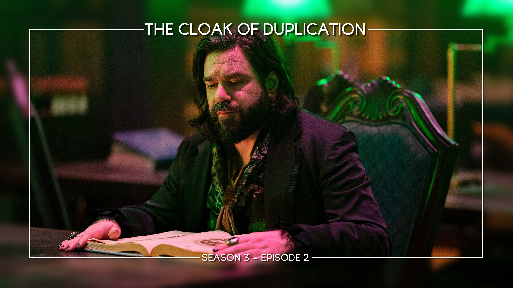

<script src="../../javascripts/home.js" defer></script>
# Welcome to TitleCardMaker

!!! warning "Under Construction"

    This documentation is actively being developed.

TitleCardMaker (TCM) is a program and Docker container written in Python that
automates the creation of customized Title Cards for use in personal media
server services like Plex, Jellyfin, or Emby.

{.no-lightbox}
{.no-lightbox}

# What is a Title Card?

A Title Card is a thumbnail image for an Episode of television that can be used
to add a unique look within a personal media server like Plex, Emby, or
Jellyfin. Some Series have "official" Title Cards featured in the Episode
itself. For example, the following Cards can both be automatically created with
TitleCardMaker:

{id="preview0" width="48%"} {id="preview1" width="48%"}

# Early Access

!!! info "Availability of Early Access"

    While the TitleCardMaker Web UI is under development, it is only accessible
    to project Sponsors. If you are interested, see
    [here](https://github.com/sponsors/CollinHeist).

## Downloading the Code

Sponsors of the project will be invited to a [private GitHub
repository](https://github.com/CollinHeist/TitleCardMaker-WebUI/). These steps
will walk you through getting the code from that repository.

1. After being invited, you will recieve an email at your GitHub's associated
email address, open it and accept the invitation to collaborate (while signed
into your GitHub account).

2. Follow [these](https://docs.github.com/en/authentication/keeping-your-account-and-data-secure/creating-a-personal-access-token#creating-a-personal-access-token-classic)
instructions to get a __classic__ personal access token (PAT) so that you can
retrieve the TCM code from git. Check the `repo` scope section. Copy this code.

    ??? question "Why is this necessary?"

        Because the repository is Private, the `git clone` command requires
        authentication. You _can_ download the zipped code from the website, but
        this makes getting updates difficult.

        A PAT is required instead of a password because GitHub does not allow
        passwords to be used from the command line.

    ??? warning "Security Warning"

        Keep this access code private, as it can be used to access your GitHub
        account.

3. Open a terminal of your choice, and go to the desired install location. Then
clone the repository with:

    ```bash
    git clone https://github.com/TitleCardMaker/TitleCardMaker-WebUI.git
    ```

4. Enter your account Username and the PAT from Step 2. The TCM code
will now be downloaded into that directory.

## Running TitleCardMaker
### Setup

1. Navigate to the installation directory within the command line.

    ??? example "Example"

        === ":material-linux: Linux"

            <!-- termynal -->

            ```bash
            cd "~/Your/Install/Directory"
            ```

        === ":material-apple: MacOS"

            ```bash
            cd "~/Your/Install/Directory"
            ```

        === ":material-powershell: Windows (Powershell)"

            ```bash
            cd 'C:\Your\Install\Directory'
            ```

        === ":material-microsoft-windows: Windows (Non-Powershell)"

            ```bash
            cd 'C:\Your\Install\Directory'
            ```

        Replace the example path with the directory from Step 3 above.

2. Within the main installation directory, create the required folder for 
TCM - this is `config` - by executing the following command:

    === ":material-linux: Linux"

        ```bash
        mkdir config
        ```

    === ":material-apple: MacOS"

        ```bash
        mkdir config
        ```

    === ":material-powershell: Windows (Powershell)"

        ```bash
        mkdir config
        ```

    === ":material-microsoft-windows: Windows (Non-Powershell)"

        ```bash
        mkdir config
        ```

3. We now need to make sure this directory has the correct permissions assigned
to them.

    === ":material-linux: Linux"

        With the Group and User ID that you would like TCM to execute with, run
        the following command:

        ```bash
        sudo chown -R {group}:{user} ./config # (1)!
        ```

        1. Replace `{group}` and `{user}` with the actual group and user (or
        their ID's) - e.g. `99:100`.

    === ":material-apple: MacOS"

        With the Group and User ID that you would like TCM to execute with, run
        the following command:

        ```bash
        sudo chown -R {group}:{user} ./config # (1)!
        ```

        1. Replace `{group}` and `{user}` with the actual group and user (or
        their ID's) - e.g. `99:100`.

    === ":material-powershell: Windows (Powershell)"

        Changing the permissions is (generally) not necessary on Windows.

    === ":material-microsoft-windows: Windows (Non-Powershell)"

        Changing the permissions is (generally) not necessary on Windows.

!!! info "Choice of Installation"

    You now have the choice of building and running the Docker container
    yourself, or launching the Python script directly.

    The Docker container is the recommended method.

### Launching the Interface

=== ":material-docker: Docker"

    1. Build the Docker image under the label `titlecardmaker`, by executing the
    following command:

        === ":material-linux: Linux"

            ```bash
            docker build -t "titlecardmaker" .
            ```

        === ":material-apple: MacOS"

            ```bash
            docker build -t "titlecardmaker" .
            ```

        === ":material-powershell: Windows (Powershell)"

            ```bash
            docker build -t "titlecardmaker" .
            ```

        === ":material-microsoft-windows: Windows (Non-Powershell)"

            ```bash
            docker build -t "titlecardmaker" .
            ```

    2. Determine your timezone, a full list is available
    [here](https://en.wikipedia.org/wiki/List_of_tz_database_time_zones). You
    will want to take note of the text in the _TZ Identifer_ column - e.g.
    `America/Los_Angeles` - for the next step.

    3. Create (and launch) the Docker container by executing the following
    command - make sure to replace `America/Los_Angeles` with _your_ timezone
    from the previous step.

        === ":material-linux: Linux"

            ```bash
            docker run -itd \ # (1)!
                --net="bridge" \ # (2)!
                -v "$(pwd)/config/":"/config/" \ # (3)!
                -e TZ="America/Los_Angeles" \ # (4)!
                -p 4242:4242 \ # (5)!
                --name "TitleCardMaker" \ # (6)!
                titlecardmaker
            ```

            1. Launch the container in the background.
            2. Ensure that TCM has access to the ports of your other Docker
            containers.
            3. Make your current directory available inside the container.
            4. Set the internal timezone equal to your local timezone.
            5. Make the TCM WebUI accessible at port 4242 on your machine.
            6. Name the container TitleCardMaker.

        === ":material-apple: MacOS"

            ```bash
            docker run -itd \ # (1)!
                --net="bridge" \ # (2)!
                -v "$(pwd)/config/":"/config/" \ # (3)!
                -e TZ="America/Los_Angeles" \ # (4)!
                -p 4242:4242 \ # (5)!
                --name "TitleCardMaker" \ # (6)!
                titlecardmaker
            ```

            1. Launch the container in the background.
            2. Ensure that TCM has access to the ports of your other Docker
            containers.
            3. Make your current directory available inside the container.
            4. Set the internal timezone equal to your local timezone.
            5. Make the TCM WebUI accessible at port 4242 on your machine.
            6. Name the container TitleCardMaker.

        === ":material-powershell: Windows (Powershell)"

            ```bash
            docker run -itd ` # (1)!
                --net="bridge" ` # (2)!
                -v "$(pwd)\config":"/config/" ` # (3)!
                -e TZ="America/Los_Angeles" ` # (4)!
                -p 4242:4242 ` # (5)!
                --name "TitleCardMaker" ` # (6)!
                titlecardmaker
            ```

            1. Launch the container in the background.
            2. Ensure that TCM has access to the ports of your other Docker
            containers.
            3. Make your current directory available inside the container.
            4. Set the internal timezone equal to your local timezone.
            5. Make the TCM WebUI accessible at port 4242 on your machine.
            6. Name the container TitleCardMaker.

        === ":material-microsoft-windows: Windows (Non-Powershell)"

            ```bash
            docker run -itd ^ # (1)!
                --net="bridge" ^ # (2)!
                -v "%cd%\config":"/config/" ^ # (3)!
                -e TZ="America/Los_Angeles" ^ # (4)!
                -p 4242:4242 ^ # (5)!
                --name "TitleCardMaker" ^ # (6)!
                titlecardmaker
            ```

            1. Launch the container in the background.
            2. Ensure that TCM has access to the ports of your other Docker
            containers.
            3. Make your current directory available inside the container.
            4. Set the internal timezone equal to your local timezone.
            5. Make the TCM WebUI accessible at port 4242 on your machine.
            6. Name the container TitleCardMaker.

=== ":material-language-python: Non-Docker"

    Run the following command to install the required Python packages and launch
    the TCM interface.

    <div class="termy" data-termynal="" data-ty-macos="" data-ty-title="Command Line"><a href="#" data-terminal-control="" style="visibility: hidden;">fast →</a><span data-ty="input" data-ty-prompt="$" style="visibility: visible;">pipenv install; pipenv run uvicorn app-main:app --host "0.0.0.0" --port 4242</span><span data-ty="" style="visibility: visible;">[DEBUG] Dumped Preferences to "[...]/TitleCardMaker/config/config.pickle"..<br>INFO:     Started server process [17385]<br>INFO:     Waiting for application startup.<br>INFO:     Application startup complete.<br>INFO:     Uvicorn running on http://0.0.0.0:4242 (Press CTRL+C to quit)<br></span><a href="#" data-terminal-control="">restart ↻</a></div>

!!! success "Success"

    TitleCardMaker is now accessible at the `http://0.0.0.0:4242` or
    `http://localhost:4242/` URL.

??? failure "Interface not accessible?"

    If your log shows

    ```log
    INFO:     Application startup complete.
    ```
    
    And neither the `http://0.0.0.0:4242`, `http://localhost:4242`, or your
    local IP address URL load into the TCM UI, then replace the `0.0.0.0` part
    of the previous command with your _local_ IP address - e.g. `192.168.0.10`.
    If you still have issues, reach out on the Discord.

# Getting Started
!!! info "Detailed Tutorial"

    For more detailed tutorials that take you step-by-step through the
    installation and setup of TitleCardMaker, continue to the Tutorial pages.

TitleCardMaker is designed to for an easy "out of the box" setup. The basic
steps are as follows:

1. Install TitleCardMaker (via Docker or locally)
2. Set up your Connections to your other services - such as Sonarr, TMDb, Plex,
Emby, Jellyfin, or Tautulli.
3. Start adding Series to TitleCardMaker - this can be done manually, or with
[Syncs](./getting_started/first_sync/index.md).
4. Customize the look and style of Title Cards to your liking.

*[PAT]: Personal Access Token
