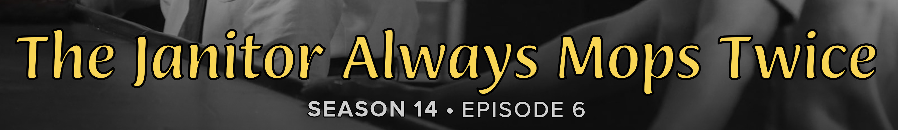

<script src="../../javascripts/fonts.js" defer></script>

# Fonts

There are two classifications of fonts in TCM - _named_ and _un-named_. _Named_
fonts are created in the :fontawesome-solid-font: `Fonts` page within TCM (at
the `/fonts` URL); while _un-named_ fonts can be added directly to a Series or
Episode. Aside from that, the only differences between these two are that
_named_ fonts can use custom font files and character replacements in addition
to metrics like font size, spacing, etc.; while unnamed fonts can __only__
adjust metrics.

{.no-lightbox}
{.no-lightbox}

This page will primarily cover _named_ fonts. In general, these Fonts apply to
the _title text_ of a particular Title Card - __not__ the season or episode
text. That is (generically) fixed, or recolored via an extra.

## Creating a New Font

At the top of the Fonts page, a new Font can be created by clicking the
<span class="example md-button">Create New Font</span> button. This will create
a "blank" Font added to the top of the page.

Clicking the accordion will expand the Font, where all customization can be
entered.

## Previewing a Font

On the right-hand side of all Fonts is a live preview of the current Font. This
preview reflects the currently entered Font settings - not necessarily what is
saved in the Font - and can be refreshed by clicking the
<span class="example md-button">:material-refresh: Refresh Preview</span> button.

### Preview Card Type

Since each Card type uses different base Font values, it is important to preview
your Font with the Card type you expect to utilize it on. While most metrics
will apply fairly consistently across the types, some metrics (typically kerning
and stroke width) will appear vastly different when applied to different cards.

### Preview Title

Above the preview image is a textbox in which you can enter the title text you
would like to display in the preview Card. 

!!! tip "Recommendation"

    I _strongly_ recommend you test an example title with more than one line of
    text when first honing in the Font metrics. Depending on the Font file and
    Card type, it is not uncommon for multiple lines of text to be poorly
    spaced.

Next to the _Preview Title_ label there is also a small
:fontawesome-solid-arrow-down-a-z: button which, when clicked, will replace the
preview title with all lower- and upper-case characters between A and Z.

## Font Customization

All Fonts have the following options which can be adjusted:

- [Name](#name)
- [File](#file)
- [Color](#color)
- [Text Case](#text-case)
- [Title Split Modifier](#title-split-modifier)
- [Size](#size)
- [Kerning](#kerning)
- [Stroke Width](#stroke-width)
- [Interline Spacing](#interline-spacing)
- [Interword Spacing](#interword-spacing)
- [Vertical Shift](#vertical-shift)
- [Character Replacement](#character-replacements)

Each of these is described in greater detail below.

### Name

A Font's name is purely for easier selection within the TCM UI. It is generally
recommended to name the Font with the name of the Series (or franchise) it will
apply to.

!!! note "Importing Blueprint Fonts"

    The name of a Font is also used to match Fonts when importing
    [Blueprints](../blueprints.md).
    
    For example - if you are importing a Blueprint featuring a Font named
    _Better Call Saul_ and have already created a Font named _Better Call Saul_,
    then TCM will not duplicate the Font and instead just assign the existing
    Font to the Series.

    This is part of the reason it is recommended to name your Fonts by the
    applicable Series or franchise.

### File

A custom Font file to use in place of the Card's default. This is _generally_
only applied to the title text of the Card.

In order for a Font file to be reflected in the live Card preview, you must
upload the File to the server and click the
<span class="example md-button">Save Changes</span> button at the bottom
of the Font.

??? note "File Location"

    Once uploaded, Font files are stored in TCM's _asset directory_. This means
    you can delete the File from your host OS after it's been uploaded into TCM.

### Color

The color of the Font to use in the Title Card. If unspecified, then the Card's
default Font color is used instead.

This variable supports all color formats and names supported by ImageMagick.
This includes hexcodes, `rgb()`, `rgba()`, `hsl()`, `hsla()`, `hsb()`, `hsba()`,
and color names.

!!! note "Color Reference"

    A full article on the ImageMagick color specification is available
    [here](https://imagemagick.org/script/color.php#color_names), and
    [here](https://imagecolorpicker.com/en) is
    a convenient color picker.

??? tip ":material-apple: MacOS Color Picker"

    If you are on MacOS, there is a very useful built-in color "picker". You can
    access this by opening `Digital Color Meter` from Spotlight. It will show
    you the RGB values of any pixel on screen, and these can be directly entered
    into an `rgb()` color code.

### Text Case

How to format the title text in the Card - i.e. upper or lowercase. This can be
one of the following:

| Case | Description |
| :---: | :--- |
| Default | Use the Card type's default case |
| Blank | Remove all title text |
| Lowercase | Make all text lowercase |
| Source | Use the title as it appears in the [Episode Data Source](./settings.md#episode-data-source) |
| Title | Apply title case logic (like in a book title) |
| Uppercase | Make all text uppercase |

Generally, leaving this as _Default_ or _Source_ is recommended, but it is often
quite Font and Card type dependent.

### Title Split Modifier

!!! note "Advanced Setting"

    This setting is fairly complicated, rarely used, and can safely be ignored
    by most users.

By default, TCM will try and automatically split title text into multiple lines.
This is done based on the number of characters in the text, as well as the
specific [card type](../card_types/index.md) being used. This setting allows
adjusting after how many characters TCM will try and split into multiple lines.

Positive values mean TCM will require _more_ characters in a line before
splitting (i.e. longer lines), and negative values will require _less_
characters (i.e. shorter lines).

This is especially useful if a custom Font [file](#file) is being used which
has a vastly different spacing or sizing than the card type's default Font.

??? example "Example"

    Take the title _The One After Ross Says Rachel_. Depending on the Card, TCM
    might split this into two lines of text like:

    ```
    The One After
    Ross Says Rachel
    ```

    But, if a modifier of +8 was specified, then TCM will now try and "fit"
    8 more characters into one line of text, for example:

    ```
    The One
    After Ross Says Rachel
    ```

    Notice how more of the title has fit on the first line.

??? question "Why doesn't TCM split titles to always fit in the image?"

    TCM currently does all the "title splitting" logic in Python - but this has
    the downside of occasionally requiring manual adjustment, and can result in
    some very long titles extending beyond the bounds of the image.

    So this inevitably begs the question: why not measure the _actual_ length of
    the title text in the image to ensure this never happens?

    The short answer is: performance. Although TCM _does_ do quite a bit of
    text metric analysis[^1] for various aspects of Cards, it is generally much
    slower than doing this in Python, and would be especially slow if required
    multiple times (like would be the case when "fitting" text on an image).

### Size

Size scale of the Font. Values >100% will _increase_ the size of the Font, and
values <100% will _decrease_ the size of the Font. Must be positive.

### Kerning

Scale of the Font's kerning. Kerning refers to the distance between letters
within the same word. For a (approximate) visual representation of this, adjust
the slider below to scale this paragraph's kerning.

<input type="range" min="-3" max="20" value="0" class="slider" id="font-kerning">

Depending on the Font and Card, it is not uncommon for Kerning values to be
very large (or very small) - for example, I used a value of 1500% for my _Jane
the Virgin_ Title Cards. 

Whether values >100% _increase_ or _decrease_ the letter
spacing is dependent on the Card.

### Stroke Width

!!! note "Stroke vs. Drop Shadows"

    Rather than using a text stroke, many card types instead feature a drop 
    shadow which will be unaffacted by this stroke width metric. In particular,
    the Calligraphy, Tinted Frame, and Lanscape cards.

Scale of the Font's stroke width. This generally refers to title text which has
an outer stroke which helps the characters appear more visible.

The follow examples showcase stroke widths of 10%, 100%, 200%, and 500%
respectively.

{width="75%"}
{width="75%"}
{width="75%"}
{width="75%"}

### Interline Spacing

Additional pixel spacing to apply between multiple lines of text. Positive
values _increase_ the spacing between lines, and negative values _decrease_ it.

### Interword Spacing

Additional pixel spacing between words in text. This is similiar to
[kerning](#kerning), except only applies to the spacing between separate words,
not the spacing between letters of the same word.

Positive values _add_ space between words, negative values _decrease_ it.

### Vertical Shift

Pixels to offset the vertical placement of the title text.

### Character Replacements

It is fairly common to come across Fonts that do not have all the characters
needed for all the titles of a given Series. Especially for titles with lots of
punctuation, or accented characters like é.

To aid with this, any Font can have a predefined set of character replacements
which will be applied to an Episode title before the Card is created. These can
be manually entered, or TCM can perform an
[automatic analysis](#character-replacement-analysis) of the Font by clicking
the <span class="example md-button">:fontawesome-solid-wand-magic-sparkles:
Analyze Font Replacements</span> button.

These replacements can take any text (the left input field) and will replace
that with the replacement text (the right input field). This replacement text
can be blank to indicate the input text should be deleted.

## Character Replacement Analysis

Under the [Character Replacements](#character-replacements) section of a Font
is a <span class="example md-button">:fontawesome-solid-wand-magic-sparkles:
Analyze Font Replacements</span> which can be pressed to prompt TCM to perform
an automated analysis of the Font and make suggested replacements.

During this analysis, TCM will look for any appropriate glyph within the Font
for all the most commonly used English characters (i.e. A-Z and all standard
punctuation). If the Font is assigned to a Template, Series, or Episode then
TCM will look at the titles of those assigned elements for characters. 

!!! tip "Analyze the Font _after_ Assignment"

    Because of this, it is recommended to perform the Font analysis _after_
    assigning the Font to the applicable Template, Series, or Episode.

TCM will then suggest replacements by looking for common character replacements
(like `&` to `and`, `’` to `'`), the lower or uppercase equivalent (if
applicable), and finally attempt a Unicode character decomposition.

!!! example "Example Analysis"

    Say the Font in question does not have the character `Á` - TCM will look for
    a "common" replacement; then `á`; and finally an `A` or `a` character.

[^1]: Technical term for analyzing some text by loading it into a "fake"
temporary image of _just_ text and taking measurements of the image space
required to display the text.
