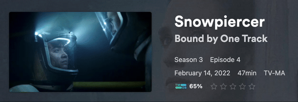

# Integrations

In addition to [Connections](./connections.md), TitleCardMaker can also
integrate directly with services (such as Plex or Tautulli) to trigger specific
functionality in TCM - such as automatically creating Title Cards for all newly
added content.

For example, Plex can be configured to notify TCM to make/remake Title Cards
when an event (in this case rating an Episode) occurs:

{.no-lightbox}

## Plex

!!! note "Plex Pass Required"

    Plex requires that you (the server owner) have a Plex Pass in order to
    enable Webhooks.

Plex can be configured to trigger Card creation in TCM via
[Webhooks](https://support.plex.tv/articles/115002267687-webhooks/). 

### Enabling

1. Configure your Plex Connection inside TCM - see
[here](../getting_started/connections/plex.md) for details.

2. Take note of the number on the right side of the Plex Connection details in
TCM - e.g. `1`, `2`, etc. You will need this later.

3. Open Plex.

4. In the top-right corner of Plex, click Settings (the wrench icon).

5. From the left-hand sidebar, navigate to _Webhooks_.

6. Click Add webhook, and then enter
the URL of your TCM server (including the port), followed by
`/api/webhooks/plex?interface_id=999`. Replace `999` with the number you noted
from Step 2.

    !!! example "Example"

        For my server, this looks like
        `http://192.168.0.29:8000/api/webhooks/plex?interface_id=2`

7. Click Save Changes.

8. From the left-hand sidebar, navigate to _Network_ under _Settings_.

9. Make sure you're viewing Advanced options, and check the _Webhooks_ checkbox
at the bottom of the page.

10. Click Save Changes.

### Customization

By default, TCM will trigger Card creation for new content (`library.new`) and
recently finished content (`media.scrobble`). If you would like to trigger new
Cards for other events (such as rating an Episode, as shown above), do the 
following:

1. Within Plex, edit the Webhook URL to include `&trigger_on=...`, replacing
`...` with a comma-separated list of triggers from Plex. A complete list is
[here](https://support.plex.tv/articles/115002267687-webhooks/), but TCM will
only be able to _actually_ trigger on `library.new`, `library.on.deck`,
`media.pause`, `media.play`, `media.rate`, `media.resume`, `media.scrobble`,
`media.stop` and `playback.started`. This argument is
`library.new,media.scrobble` by default.

    !!! example "Example"

        The example above used the following URL:
        `http://192.168.0.29:8000/api/webhooks/plex?interface_id=2&trigger_on=library.new,media.scrobble,media.rate`

2. Click Save Changes.

## Sonarr

!!! warning "Sonarr v4 Required"

    The Webhook utilized by TCM was reworked in Sonarr v4; meaning this is
    required for the integration.

Sonarr can be configured to create new Cards, or add/delete Series in TCM via
Webhooks.

### Enabling

1. Open Sonarr.

2. From the left-hand sidebar, navigate to :fontawesome-solid-gears: `Settings`,
then `Connect`.

3. Click the plus icon to create a new Connection. At the bottom of the dialog,
click _Webhook_.

4. Give this a descriptive name.

5. Leave the Tags field blank (unless you'd like to filter by tag).

Depending on the type of integration you would like to enable, do the following:

=== "New Series"

    1. To configure Sonarr to instruct TCM to add Series as they're added to
    Sonarr, de-select all triggeres except `On Series Add`.

    2. Enter the URL of your TCM server (including the port), followed by
    `/api/webhooks/sonarr/series/add`.

    3. Ensure the Method is `POST`.

    4. Click Save.

=== "Series Deletion"

    1. To configure Sonarr to instruct TCM to remove Series as they're deleted
    from Sonarr, de-select all triggers except `On Series Delete`.

    2. Enter the URL of your TCM server (including the port), followed by
    `/api/webhooks/sonarr/series/delete`.

    3. If you would like TCM to _not_ delete the Title Card files themselves,
    add `?delete_title_cards=false` to the end of the URL.

    4. Ensure the Method is `POST`.

    5. Click Save.

=== "New Episode(s)"

    1. To configure Sonarr to instruct TCM to create Cards for new Episodes as
    they're added to Sonarr, de-select all triggers except `On Import Complete`
    and `On File Upgrade`.

    2. Enter the URL of your TCM server (including the port), followed by
    `/api/webhooks/sonarr/cards`.

    3. Ensure the Method is `POST`.

    4. Click Save.

Multiple of the above integrations may be enabled at once, if desired.

## Tautulli

!!! tip "Plex Webhooks are Preferred"

    [Plex Webhooks](#plex) are the preferred integration for most users. This is
    due to their faster speed, ease of setup, and flexibility in trigger
    conditions.

Tautulli can be set up to trigger Card creation for newly added or watched
content (just like Plex Webhooks) via the builtin Notification Agents system.

### Enabling

1. In TCM, under the Plex Connection form that has a Tautulli connection, click
Create Notification Agent.

2. In the launched window, enter the _root_ URL to your instance of Tautulli.

    ??? example "Example URL"

        Although your local IP address will obviously be different, this IP
        should be _like_ `http://192.168.0.29:8181/`.

3. Open Tautulli and navigate to the Settings by clicking the 
:fontawesome-solid-gears: Gear icon in the top right.

4. From the left navigation bar, open the `Web Interface` settings.

5. Scroll to the bottom, and ensure the `Enable API` checkbox is checked, then
show and copy the generated API key.

    ??? danger "Security Warning"

        Keep this API key private, as it can be used to remotely access and
        modify Tautulli.

6. Back within TitleCardMaker, paste the API key from Step 5 into the API key
input box.

7. If you want Tautulli to trigger TitleCardMaker when episodes are watched,
and not just when episodes are added, then leave the `Trigger on Recently
Watched` checkbox checked. I also recommend entering your username in the
username input so that Tautulli is only triggered when you watch content.

8. Click Create Agent.

8. Open Plex (on a computer) and navigate to your server settings via the
:material-wrench-outline: Wrench icon in the top right corner.

9. From the left navigation bar, scroll down to `Library` under the `Settings`
section and take note of your `Video Played Threshold` setting (this is an
Advanced Setting).

10. Back in Tautulli, open the `General` settings from the sidebar, and find the
`TV Episode Watched Percent` setting. Set this to 1-2% _higher_ than the Plex
setting from Step 9.

    ??? example "Example Setting"

        For a Plex played threshold of 90%, the appropriate Tautulli setting is
        91% or 92%.

    ??? question "Why is this Necessary?"
    
        Because this integration is so fast (typically triggering within 5
        seconds of finishing an Episode) - it is imperative that Tautulli
        triggers TCM to update a Title Card _after_ an Episode's watch-status
        has had time to update within Plex.

Once created, you can close the box within TCM. Unlike the other Connections,
your Tautulli connection details __will not__ be stored (and so will not appear)
in TCM - this is because TCM only submits API requests to Tautulli to
create an agent. Afterwards, it is Tautulli that sends data to TCM, and so no
active connection is required.

