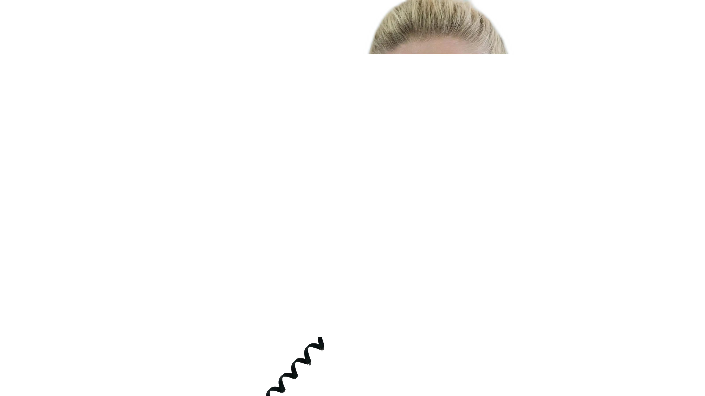
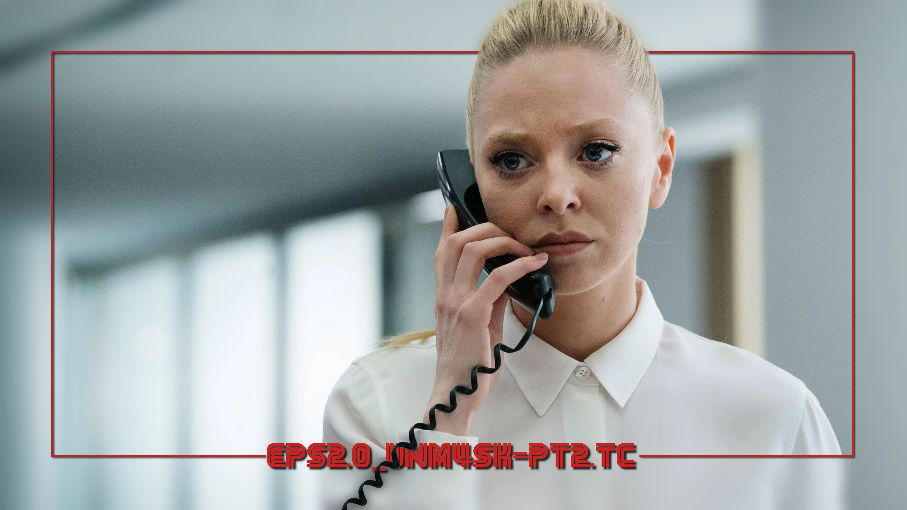

<link rel="stylesheet" type="text/css" href="https://unpkg.com/image-compare-viewer/dist/image-compare-viewer.min.css">
<script src="../../javascripts/imageCompare.js" defer></script>

# Mask Images

## Background

During Card creation, TCM can search for special images referred to as "mask
images." These are special images located alongside the Card's specified Source
Image which are applied _after_ all other Card effects.

Because these images are added on top of the Card after all other effects and
image processing, these Mask images can be used to add a "depth" effect to the
Card.

## Examples

<div class="image-compare example-card"
    data-starting-point="42"
    data-left-label="Mask Image"
    data-right-label="Resulting Title Card">
    
    
</div>

<div class="image-compare example-card"
    data-starting-point="31.3"
    data-left-label="Mask Image"
    data-right-label="Resulting Title Card">
    
    
</div>

## Mask File Naming

TCM will look for mask images of a specific name based on the file name of the
input Source Image; these are, in order:

1. `{filename}-mask.*`
2. `{filename}_mask.*`
3. `mask.*`

These masks must be in the same directory as the Source Image (i.e. that Series'
Source Directory).

!!! note "File Extension"

    The above `.*` means that TCM will accept any file extension - but the
    optimal effect can be achieved with file types which support transparency
    (`.webp` and `.png`).

!!! example "Example"

    If a Card is being created with the _default_ Source Image, e.g. `s1e3.jpg`,
    then TCM will look for mask files named `s1e3-mask`, then `s1e3_mask`, and
    finally `mask` in the same directory.

The generic `mask` file is searched for if you would like to apply a Series-wide
mask image, such as a logo.

## Supported Card Types

Although not all [Card Types](../card_types/index.md) support mask images, a
vast majority do. Currently all builtin Card Types support this feature
_except_:

- [Fade](...)
- [Poster](...)
- [Textless](...) (as this would be useless)

## Processing

Some Card Types apply pre-processing to the Source Image (such as the
[Anime](../card_types/anime.md) Card which increases the contrast); TCM will
auto-apply all of these pre-processing affects to any mask images before they
are added to the Card to avoid visual artifacts.

TCM will also resize the mask image to the size of the default Card canvas used
in Card creation (3200x1800), so ensure the mask was saved in the same
aspect ratio to avoid distortion.

## Creating Mask Images

TCM does not provide any functionality for creating mask images. This should
generally be done in some external image editing software like Photopea, or
Photoshop. Both services have content-aware subject select tools which are very
helpful at extracting a person/thing from the underlying image.

If you are willing to set up another piece of Software, I've had great success
with the command line tool
[BackgroundRemover](https://github.com/nadermx/backgroundremover)

```bash
python -m backgroundremover.cmd.cli -i "input.jpg" -o "output-mask.png"
```
