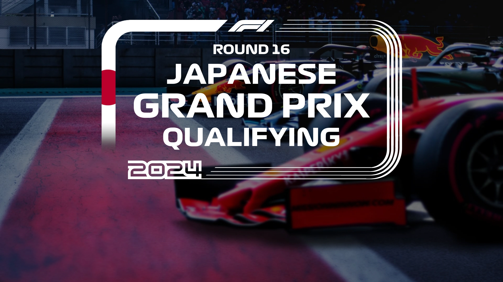

<link rel="stylesheet" type="text/css" href="https://unpkg.com/image-compare-viewer/dist/image-compare-viewer.min.css">
<script src="../../../javascripts/imageCompare.js" defer></script>

# Formula 1 Card Type

!!! warning "Applicability"

    This card type is generally not applicable to non-F1 Series.

Title Card designed for displaying race details for Formula 1. The original
design was created by Reddit User
[/u/heeisenbeerg](https://www.reddit.com/u/heeisenbeerg). Sponsor
isaacolsen94 requested its implementation into TCM as a
[Sponsor Reward](https://github.com/sponsors/CollinHeist?frequency=one-time),
which was then created by [CollinHeist](https://github.com/CollinHeist).

This card type is used whenever `card_type` is specified as `f1` or `formula 1`.

## Example

<div class="image-compare example-card"
    data-starting-point="80"
    data-left-label="Standard" data-right-label="Blurred">
    
    
</div>

## Valid `extras` { data-toc-label="Valid Extras" }

Below is a table of all valid series extras parsed by this card. These are
described in greater detail below.

| Label | Default Value | Description |
| :---: | :-----------: | :---------- |
| `country` | _Parsed from the season title_ | Which country flag to use |
| `race` | `Grand Prix` | Name of the race to display on the Card |
| `episode_text_color` | `white` | Color of the episode text |
| `episode_text_font_size` | `1.0` | Scalar of the size of the episode text |
| `flag` | _Parsed from `country`_ | Flag file to use on the left frame of the card |
| `frame_year` | _Airdate of the episode, or `2024`_ | Which frame year to utilize |

## Customization

From top to bottom, the elements on this card are:

- The episode text (`ROUND 16` in the example Card)
- The season text (`JAPANESE` in the example Card)
- The `race` (`GRAND PRIX` in the example Card)
- The title text (`QUALIFYING` in the example Card)

### Country (`country`) { data-toc-label="Country" }

This Card comes with various flags of many of the supported countries which can
be used in the surrounding "frame" containing the text.

The full list of supported values is below:

??? tip "Supported `country` values"

    This __must__ be one of:

    - `Abu Dhabi`
    - `Australian`
    - `Austrian`
    - `Azerbaijan`
    - `Bahrain`
    - `Belgian`
    - `British`
    - `Canadian`
    - `Chinese`
    - `Dutch`
    - `Hungarian`
    - `Italian`
    - `Japanese`
    - `Las Vegas`
    - `Mexican`
    - `Miami`
    - `Monaco`
    - `Qatar`
    - `Sao Paulo`
    - `Saudi Arabian`
    - `Singapore`
    - `Spanish`
    - `United Arab Emirates`
    - `United States`

#### Default Behavior

By default, the value of `country` is parsed from the season title. This is done
so that the value can change for different seasons (i.e. different F1 locations).

??? example "Example"

    The following example would 

    ```yaml hl_lines="4-8"
    series:
      F1 (2020):
        card_type: formula 1
        seasons:
          1: Australian
          2: Chinese
          3: Las Vegas
          4: Qatar
    ```

This will not happen if `country` is explicitly specified.

### Race (`race`) { data-toc-label="Race" }

The "race text" can be adjusted with the `race` extra. The default value is
`Grand Prix`.

??? example "Example"

    The following with use the default race text of "Grand Prix"

    ```yaml hl_lines="6"
    series:
      F1 (2020):
        card_type: formula 1
        extras:
          country: Japanese
          race: Grand Prix
    ```

### Episode Text

#### Color (`episode_text_color`) { data-toc-label="Episode Text Color" }

The color of the episode text (the top two lines of text on the Card) can be
adjusted with the `episode_text_color` extra. The default is `white`.

??? example "Example"

    The following will set the color of the episode text to red.

    ```yaml hl_lines="6"
    series:
      F1 (2020):
        card_type: formula 1
        extras:
          country: Japanese
          episode_text_color: red
    ```

#### Size (`episode_text_font_size`) { data-toc-label="Episode Text Size" }

The size of the episode text can also be adjusted. The default is `1.0` means no
adjustment. Values below `1.0` will reduce the size of the text, and values
above `1.0` will increase the size.

??? example "Example"

    The following will result in a 10% increase in the size of the text.

    ```yaml hl_lines="6"
    series:
      F1 (2020):
        card_type: formula 1
        extras:
          country: Japanese
          episode_text_font_size: 1.1
    ```

### Flag (`flag`) { data-toc-label="Flag" }

The left side of the frame can be changed to various flags via the `flag` extra.
If this extra is not specified then the flag is parsed from the
[`country`](#country-country) extra.

This extra is only required if you wish to use a custom flag file.

??? example "Example"

    This will use the British flag, even though the default flag would be the
    Japanese one.

    ```yaml hl_lines="6"
    series:
      F1 (2020):
        card_type: formula 1
        extras:
          country: Japanese
          flag: ./modules/ref/formula/british.webp
    ```

### Year (`frame_year`) { data-toc-label="Year" }

At the bottom of the card is the year in which the race took place. By default,
this is parsed from the airdate of the Card's episode, but if that info is not
available then this can be set with the `frame_year` extra (if you want a value
other than `2024`).

??? example "Example"

    The following will set the frame year to `2023` __only if__ there is no
    airdate available for the episode.

    ```yaml hl_lines="6"
    series:
      F1 (2020):
        card_type: formula 1
        extras:
          country: Japanese
          frame_year: "2023"
    ```
