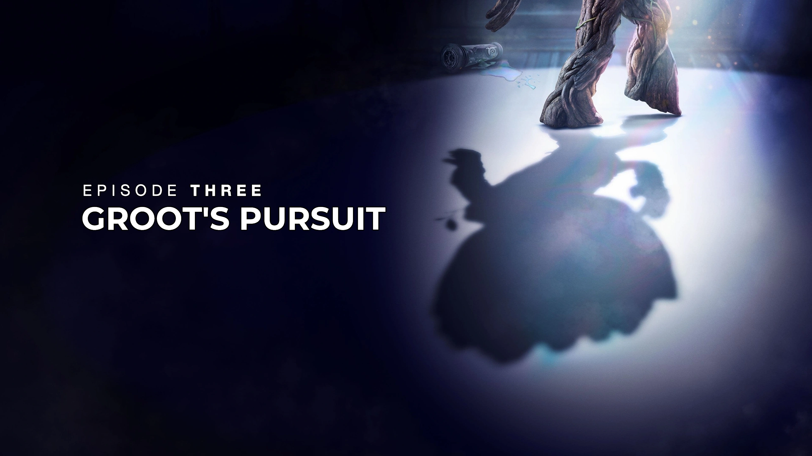
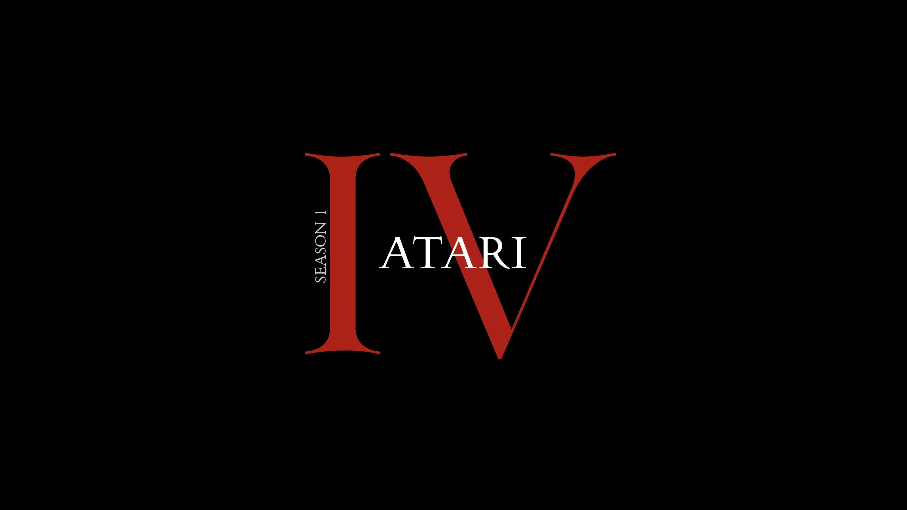

# Custom Card Types

## Background

The TitleCardMaker has been designed to permit the creation of any style/type of
Title Card, and the card type can then be specified globally or per-show. How to
specify the global card type is described [here](...).

In addition to customizing individual parts of a Title Card like the text,
styling, and font, TitleCardMaker is designed to support multiple different
types of Title Cards. These different types vary in more fundamental ways such
as layout, text placement, and additional features.

There are three different types of card types:

Built-in

:   Card types developed by yours truly and shipped as part of TitleCardMaker.
    These types are typically the most thoroughly tested and support all the
    features of TitleCardMaker.

User-made

:   Cards developed by users of TCM who have taken the effort to make these
    available for others. These cards are not officially maintained, and so are
    not guaranteed to support all features. These are downloaded while TCM is
    running from the
    [card types repository](https://github.com/CollinHeist/TitleCardMaker-CardTypes).

Local

:   Cards as Python files that exist on your local machine and are only
    available to yourself. These are read and loaded dynamically when TCM
    launches (and periodically after that). These can be used to test cards as
    they are being developed, but do require a little but of Python knowledge.

These are all specified via the `card_type` attribute for a specific series,
library, template, or globally. An example of each is shown below.

!!! example "Example"

    === "Built-in"

        ```yaml
        card_type: tinted frame
        ```

    === "User Created (Remote)"

        ```yaml
        card_type: Beedman/GradientLogoTitleCard
        ```

    === "Local File"

        ```yaml
        card_type: ./path/to/Card.py
        ```


## Built-in Types

TitleCardMaker currently has the following built-in card types:

| Card Type                           | `card_type` Value |                    Preview                                                            |
| :---------------------------------: | :----------------------------------: | :----------------------------------------------------------------: |
| [Anime](./anime.md)                 | `anime`                              |          |
| [Banner](./banner.md)               | `banner`                             |         |
| [Calligraphy](./calligraphy.md)     | `calligraphy`                        |    |
| [Comic Book](./comic_book.md)       | `comic book`                         |     |
| [Cutout](./cutout.md)               | `cutout` or `phendrena`              |         |
| [Divider](./divider.md)             | `divider`                            |        |
| [Fade](./fade.md)                   | `fade` or `4x3`                      |           |
| [Formula 1](./formula_1.md)         | `formula 1` or `f1`                  |        |
| [Frame](./frame.md)                 | `frame` or `photo`                   |          |
| [Graph](./graph.md)                 | `graph`                              |          |
| [Inset](./inset.md)                 | `inset`                              |          |
| [Landscape](./landscape.md)         | `landscape`                          |      |
| [Logo](./logo.md)                   | `logo` or `reality tv`               |           |
| [Marvel](./marvel.md)               | `marvel`                             |         |
| [Music](./music.md)                 | `music` or `spotify`                 |          |
| [Notification](./notification.md)   | `notification`                       |   |
| [Olivier](./olivier.md)             | `olivier` or `ishalioh`              |        |
| [Overline](./overline.md)           | `overline`                           |       |
| [Poster](./poster.md)               | `poster` or `gundam`                 |         |
| [Roman Numeral](./roman_numeral.md) | `roman` or `roman numeral`           |  |
| [Shape](./shape.md)                 | `shape`                              |          |
| [Standard](./standard.md)           | `standard`, `generic`, or `polymath` |       |
| [Star Wars](./star_wars.md)         | `star wars`                          |      |
| [Striped](./striped.md)             | `striped`                            |        |
| [Textless](./textless.md)           | `textless`                           |       |
| [Tinted Frame](./tinted_frame.md)   | `tinted frame` or `blurred border`   |   |
| [Tinted Glass](./tinted_glass.md)   | `tinted glass` or `sherlock`         |   |
| [White Border](./white_border.md)   | `white border` or `musikmann`        |   |

## User-Submitted Types

There is a companion repository for user-submitted custom card types, located
[here](https://github.com/CollinHeist/TitleCardMaker-CardTypes). TCM allows for
these types to be specified anywhere, and then downloaded and used at runtime.

Below is a showcase of all the user-submitted types available:

| Creator   | `card_type` Value | Example |
| :-------: | :---------------: | :---: |
| azuravian | `azuravian/TitleColorMatch`         |  |
| KHthe8th  | `KHthe8th/TintedFramePlusTitleCard` |  |
| lyonza    | `lyonza/WhiteTextBroadcast`         |  |
| Wdvh      | `Wdvh/StarWarsTitleOnly`            |  |
| Wdvh      | `Wdvh/WhiteTextStandard`            |  |
| Wdvh      | `Wdvh/WhiteTextAbsolute`            |  |
| Wdvh      | `Wdvh/WhiteTextTitleOnly`           |  |
| Yozora    | `Yozora/RetroTitleCard`             |  |
| Yozora    | `Yozora/SlimTitleCard`              |  |

## Local Cards

Whether for development of a custom card type, or just for your own personal
use, a local file can also be used as a series/library card type. This is done
by specifying the filepath to the card, such as:

```yaml
card_type: ./config/card_types/TestingCard.py
```

!!! note "Note"

    The creation of custom cards types does require a moderate level of
    technical/programming know-how

For those with at least a basic understanding  of - or willingness to learn -
Python and ImageMagick, creating new types of cards is quite simple. The process
can be simplified to the following:

1. Identify the look of the desired card - this is less _programming_ and more
_graphic design_.
   - If you're playing around with ideas, I recommend getting a basic outline
   completed in a GUI-based editing program (so **not ImageMagick**) such as
   Photopea, Photoshop, GIMP, etc., as the visual feedback is immediate and less
   tedious than making small adjustments in ImageMagick.

2. With a basic layout finalized, identify which elements of the card you'd like
customizable by each series/show. Think about such questions as:
   - Does the card's style only really work with a fixed font/color/size, or do
   you want to allow for customization?
   - If there are season titles on the image, do you use custom season titles?
   - What "data" does the card use? For example, all title cards probably use
   the episode title itself, but does your design also use the show title? Or
   perhaps the air-date? 

3. Develop the set of ImageMagick commands necessary for creating your title
card. This can involve a lot of searching "how to...", but looking through
existing card classes might help.
   - Try and create the cards in steps (that will eventually become methods in
   the `CardType` class) such as "resize the source image" then "add _ overlay"
   and finally "add some title text"
   - I usually have a "reference" card created in a GUI-editor that I am pull up
   alongside my "working" card created by ImageMagick, viewing them side-by-side
   can help make the minor text size and positioning modifications a lot easier.

4. Create the Python class that implements these identified features. This class
**must** be a subclass of `CardType`, and as such must implement the properties
and methods described in that class:
   - `TITLE_CHARACTERISTICS`: Dictionary with keys `max_line_width`,
   `max_line_count`, and `top_heavy`
   - `ARCHIVE_NAME`: String to append to all archives associated with this type
   - `TITLE_FONT`: String that is the default font to use for episode title text
   - `TITLE_COLOR`: String that is the
   [ImageMagick color](https://imagemagick.org/script/color.php) to use for
   episode title text
   - `FONT_REPLACEMENTS`: Dictionary of characters to substitute if the default
   font is used
   - `USES_SEASON_TITLE`: Whether season titles are used in this title card
   - `is_custom_font()`: Method to determine whether a custom font has been used
   - `is_custom_season_titles()`: Method to determine whether custom season
   titles/text has been used
   - `create()`: Method for creating the title card object defined by the class

5. Make the modifications outlined on the companion repository
[here](https://github.com/CollinHeist/TitleCardMaker-CardTypes/wiki/Creating-a-Custom-Card-Type).

6. Follow the contribution process described
[here](https://github.com/CollinHeist/TitleCardMaker-CardTypes#contributing).