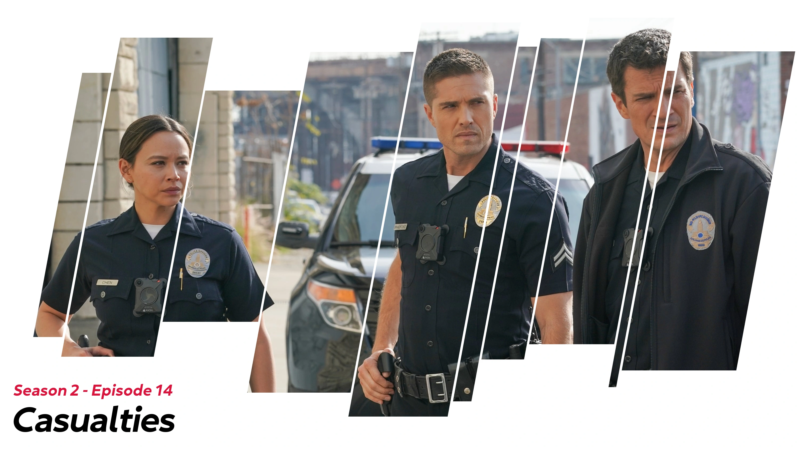
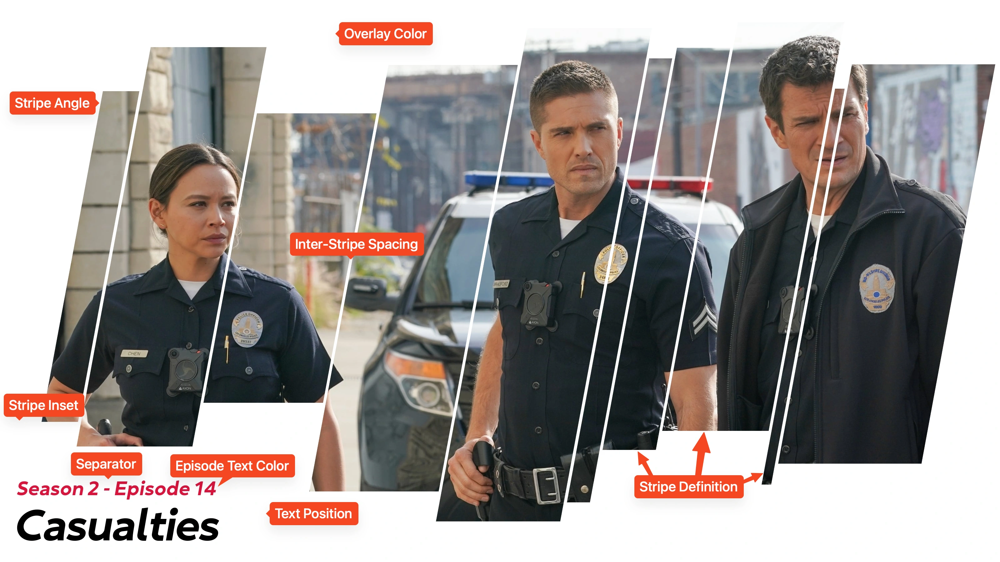

<link rel="stylesheet" type="text/css" href="https://unpkg.com/image-compare-viewer/dist/image-compare-viewer.min.css">
<script src="../../../javascripts/imageCompare.js" defer></script>

# Striped Card Type

These cards feature a solid color overlay with stripes of rectangles "cut" out
to expose the underlying Source Image. By default the stripes are randomly
placed and sized, but this can be adjusted with [an extra](#definition). The
position of the text can also be adjusted to any of the four corners.

This card type is used whenever `card_type` is specified as `striped`.

## Example

<div class="image-compare example-card"
    data-starting-point="80"
    data-left-label="Standard" data-right-label="Blurred">
    
    
</div>

??? note "Labeled Card Elements"

    

## Valid `extras` { data-toc-label="Valid Extras" }

| Label                    | Default Value      | Description                                          |
| :----------------------: | :----------------: | :--------------------------------------------------- |
| `angle`                  | `#!yaml 79.5`      | Angle of the stripes                                 |
| `episode_text_color`     | `crimson`          | Color to utilize for the episode text                |
| `episode_text_font_size` | `#!yaml 1.0`       | Size adjustment for the season and episode text      |
| `inset`                  | `#!yaml 50`        | How far to inset the start and end of the stripes    |
| `inter_stripe_spacing`   | `#!yaml 8`         | Spacing between stripes                              |
| `overlay_color`          | `white`            | Color of the overlay                                 |
| `polygons`               | `random[ssmmmlll]` | Format for the size and order of the stripes         |
| `separator`              | ` - `              | Character that separates the season and episode text |
| `text_position`          | `lower left`       | Position of the text on the image                    |

## Customization

### Stripe Adjustments

#### Angle (`angle`) { data-toc-label="Angle" }

The angle of the stripes can also be adjusted with the `angle` extra. A value of
90 degrees will result in the stripes being perfectly vertical, and the
"orientation" of the stripes can be reversed by specifying angles larger than 90.

??? example "Examples"

    ```yaml title="tv.yml" hl_lines="5"
    series:
      The Rookie (2018):
        card_type: striped
        extras:
          angle: 85
    ```

    <div class="image-compare example-card"
        data-starting-point="50"
        data-left-label="79.5" data-right-label="85">
        
        
    </div>

#### Definition (`polygons`) { data-toc-label="Definition" }

!!! warning "Advanced Setting"

    This setting is fairly complicated relative to the other available extras.

The specific order, width, and level of randomization of the stripes can be
fine-tuned with the `polygons` extra.

By default, this card selects a random size and then a random width of that
size - repeating the process until the card is "full" (i.e. no more horizontal
space). These pre-defined sizes are "small", "medium", and "large" and have been
abbreviated as `s`, `m`, and `l`.

This extra supports six different "kinds" of unique patterns to control how
the stripes are drawn.

##### Random Order, Random Sizes

Specifying a definition _like_ `random[sml]` will instruct TCM to randomly select
a stripe of the listed sizes _in_ the specified ratio. This means that repeating
sizes - e.g. `random[sssssml]` - will result in those appearing with increased
frequency. For example `sml` will mean all sizes are equally likely, while
`ssml` will mean small stripes are twice as likely as medium or large. The width
of each stripe will use the builtin size ranges.

??? example "Examples"

    ```yaml title="tv.yml" hl_lines="5"
    series:
      The Rookie (2018):
        card_type: striped
        extras:
          polygons: random[smllllll]
    ```

    Notice how the right-image has a much higher frequency of large (`l`)
    stripes.

    <div class="image-compare example-card"
        data-starting-point="50"
        data-left-label="random[ssmmmlll]" data-right-label="random[smllllll]">
        
        
    </div>

This pattern will always fill the width of the card.

##### Random Order, Fixed Sizes

Specifying a definition _like_ `random[100,200]` will instruct TCM to randomly
select stripes of the listed width in the specified ratio. For example,
`random[100,200]` will result in random stripes of either 100 or 200 pixels
wide. Repition is allowed. These must be comma-separated positive values.

??? example "Examples"

    ```yaml title="tv.yml" hl_lines="5"
    series:
      The Rookie (2018):
        card_type: striped
        extras:
          polygons: random[100,200]
    ```

    <div class="image-compare example-card"
        data-starting-point="50"
        data-left-label="random[ssmmmlll]" data-right-label="random[100,200]">
        
        
    </div>

This pattern will always fill the width of the card.

##### Random Order, Random Size Ranges

Specifying a definition _like_ `random[10-20,200-250]` will instruct TCM to
randomly select stripes of random widths from the specified ranges in the
specified ratios. For example: `random[10-20,200-250]` will result in random
stripes of widths between 10 and 20 pixels _or_ 200 and 250 pixels (in equal
likelihood). Repition is allowed. These must be comma-separated positive values
in which the second value is equal to or greater than the first.

??? example "Examples"

    ```yaml title="tv.yml" hl_lines="5"
    series:
      The Rookie (2018):
        card_type: striped
        extras:
          polygons: random[10-20,200-250]
    ```

    <div class="image-compare example-card"
        data-starting-point="50"
        data-left-label="random[ssmmmlll]" data-right-label="random[10-20,200-250]">
        
        
    </div>

This pattern will always fill the width of the card.

##### Fixed Order, Random Sizes

Specifying a definition _like_ `sml` will instruct TCM to generate stripes in
the specified order of random widths. For example: `sml` will always generate a
small, medium, and large stripe (repeated if a `+` is specified). The width of
each stripe will use the builtin size ranges.

??? example "Examples"

    ```yaml title="tv.yml" hl_lines="5"
    series:
      The Rookie (2018):
        card_type: striped
        extras:
          polygons: sml+
    ```

    <div class="image-compare example-card"
        data-starting-point="50"
        data-left-label="random[ssmmmlll]" data-right-label="sml+">
        
        
    </div>

This pattern will __not repeat__ unless it ends with `+` - e.g. `sml+`.

##### Fixed Order, Fixed Sizes

Specifying a definition _like_ `10,100,400` will instruct TCM to generate
stripes in the specified order of the specified widths. For example:
`10,100,400` will generate stripes that are 10, 100, and 400 pixels wide
(repeated if a `+` is specified). These must be comma-separated positive values.

??? example "Examples"

    ```yaml title="tv.yml" hl_lines="5"
    series:
      The Rookie (2018):
        card_type: striped
        extras:
          polygons: 10,100,400+
    ```

    <div class="image-compare example-card"
        data-starting-point="50"
        data-left-label="random[ssmmmlll]" data-right-label="10,100,400+">
        
        
    </div>

This pattern will __not repeat__ unless it ends with `+` - e.g. `10,100,400+`.

##### Fixed Order, Random Size Ranges

Specifying a pattern _like_ `10-50,400-800` will instruct TCM to generate
stripes in the specified order of random widths from the specified ranges. For
example: `10-50,400-800` will result in a stripe between 10 and 50 pixels wide,
and another between 400 and 800 pixels wide (repeated if a `+` is specified).
These must be comma-separated positive values.

??? example "Examples"

    ```yaml title="tv.yml" hl_lines="5"
    series:
      The Rookie (2018):
        card_type: striped
        extras:
          polygons: 10-50,400-800+
    ```

    <div class="image-compare example-card"
        data-starting-point="50"
        data-left-label="random[ssmmmlll]" data-right-label="10-50,400-800+">
        
        
    </div>

This pattern will __not repeat__ unless it ends with `+` - e.g. `10-50,400-800+`.

### Inter-Stripe Spacing (`inter_stripe_spacing`) { data-toc-label="Inter-Stripe Spacing" }

The spacing between sequential stripes can be adjusted with the
`inter_stripe_spacing` extra.

??? example "Examples"

    ```yaml title="tv.yml" hl_lines="5"
    series:
      The Rookie (2018):
        card_type: striped
        extras:
          inter_stripe_spacing: 10
    ```

    <div class="image-compare example-card"
        data-starting-point="50"
        data-left-label="8" data-right-label="10">
        
        
    </div>

### Episode Text Adjustments

For adjustments, the "episode text" refers to the combined season and episode
text.

#### Color (`episode_text_color`) { data-toc-label="Color" }

The color of the episode text can be adjusted with the `episode_text_color`
extra.

??? example "Examples"

    ```yaml title="tv.yml" hl_lines="5"
    series:
      The Rookie (2018):
        card_type: striped
        extras:
          episode_text_color: black
    ```

    <div class="image-compare example-card"
        data-starting-point="10"
        data-left-label="crimson" data-right-label="black">
        
        
    </div>

#### Size (`episode_text_font_size`) { data-toc-label="Size" }

The size of the episode text can be adjusted with the `episode_text_font_size`
extra. The boundaries for the stripe height are dynamically adjusted to prevent
the stripes from overlapping the episode text.

??? example "Examples"

    ```yaml title="tv.yml" hl_lines="5"
    series:
      The Rookie (2018):
        card_type: striped
        extras:
          episode_text_font_size: 1.2
    ```

    <div class="image-compare example-card"
        data-starting-point="10"
        data-left-label="1.0" data-right-label="1.2">
        
        
    </div>

### Overlay Color (`overlay_color`) { data-toc-label="Overlay Color" }

The color of the solid overlay can be adjusted with the `overlay_color` extra.
This extra _does_ support transparency.

??? example "Examples"

    ```yaml title="tv.yml" hl_lines="5"
    series:
      The Rookie (2018):
        card_type: striped
        extras:
          overlay_color: azure
    ```

    <div class="image-compare example-card"
        data-starting-point="10"
        data-left-label="white" data-right-label="azure">
        
        
    </div>

### Separator Character (`separator`) { data-toc-label="Separator Character" }

If both the season and episode text are displayed on the Card, then a separator
character is added between them. This character can be adjusted with the
_Separator Character_ extra.

## Mask Images

This card also natively supports [mask images](../user_guide/mask_images.md).
Like all mask images, TCM will automatically search for alongside the input
Source Image in the Series' source directory, and apply this atop all other Card
effects.

!!! example "Example"

    <div class="image-compare example-card"
        data-starting-point="83"
        data-left-label="Mask Image" data-right-label="Resulting Title Card">
        
        
    </div>
